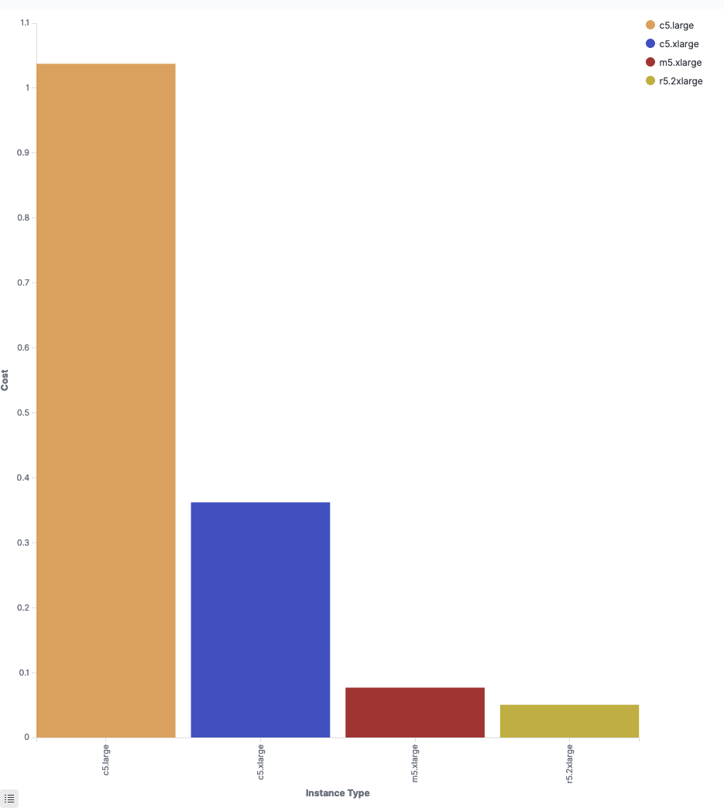
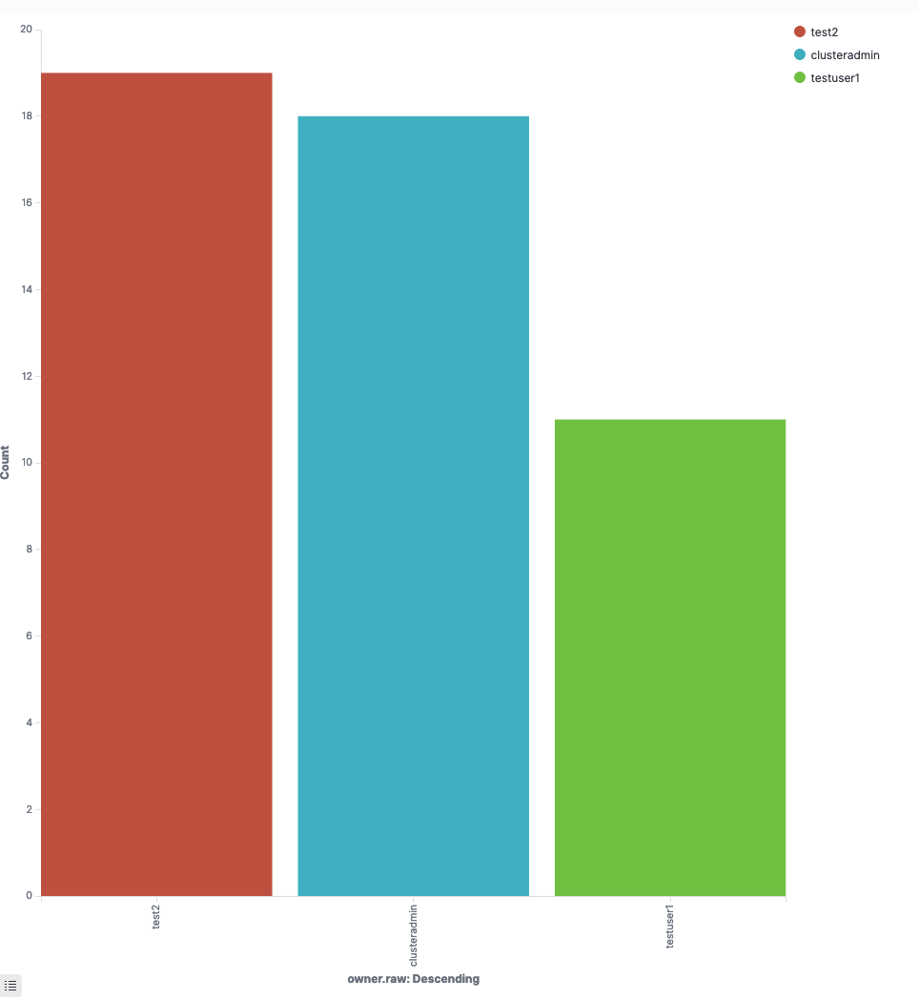
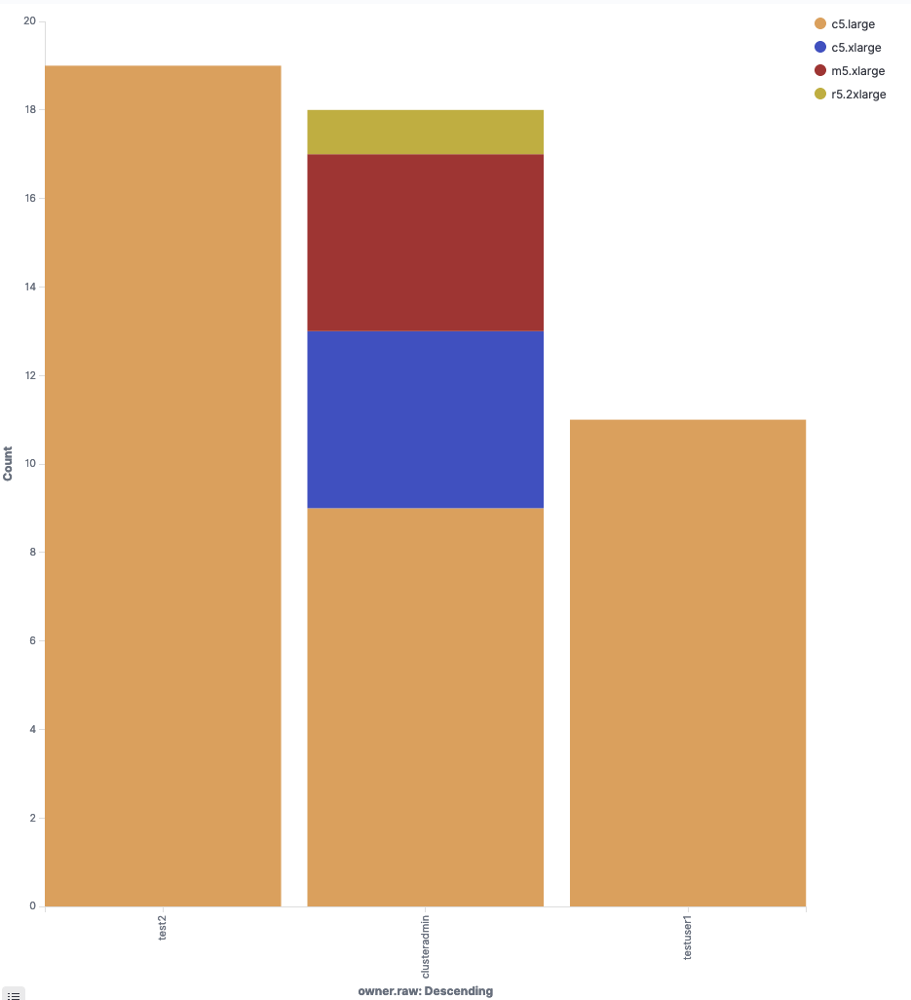
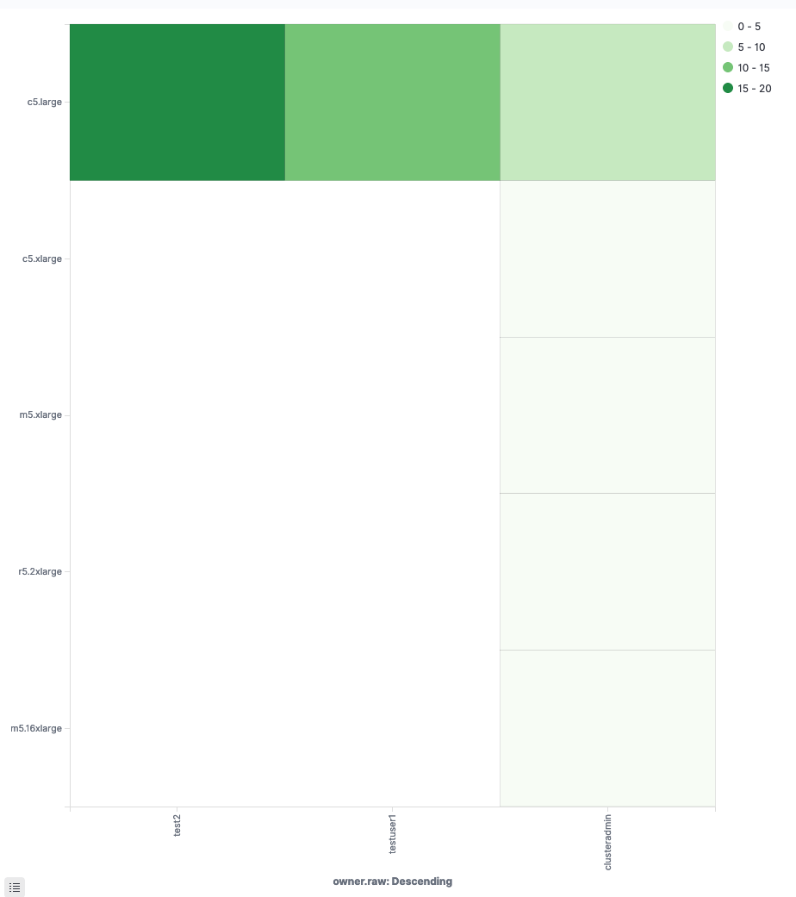
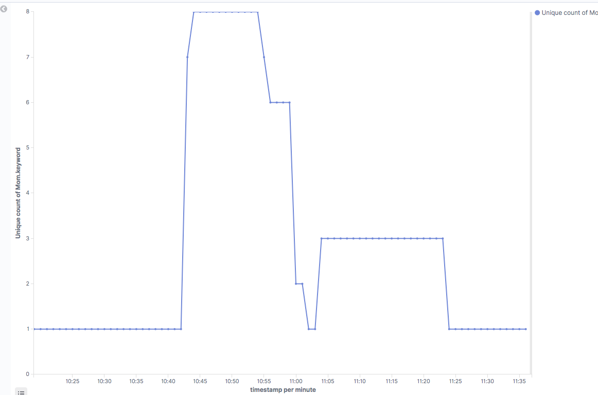
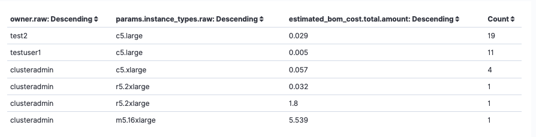
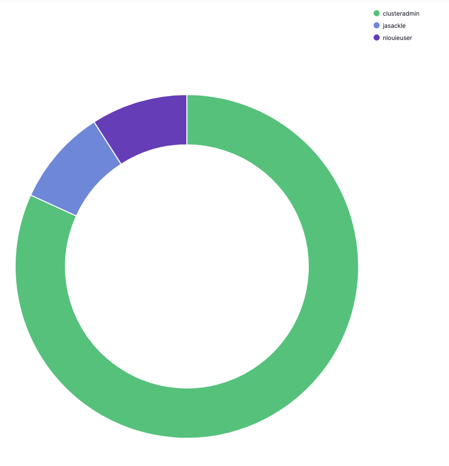

# Create your own analytics visualizations


Make sure to have reviewed [configure-your-opensearch.md](configure-your-opensearch.md "mention")


Click the hamburger menu to reveal the left sidebar then click "**Visualize**" under "**OpenSearch Dashboards**" section.

Below are some example to help you get started:

(Scale-Out-Workloads) Money spent by instance type

* Select "Vertical Bars"
* Select the "scheduler\_jobs" index
* Y Axis (Metrics):
  * Aggregation: Sum
  * Field: estimated\_bom\_cost.line\_items\_total.amount
  * Custom Label: Cost
* X Axis (Buckets):
  * Aggregation: Terms
  * Field: params.instance\_types\_raw
  * Order By: metric: Cost
  * Size (adjust as needed): 20
  * Custom Label: Instance Type
* Split Series (Buckets):
  * Sub Aggregation: Terms
  * Field: params.instance\_types\_raw
  * Order By: metric: Sum of Cost
  * Size (adjust as needed): 20

Example (click to enlarge):

(Scale-Out-Workloads) Jobs per user

* Select "Vertical Bars"
* Select "scheduler\_jobs\*" index
* Y Axis (Metrics)
  * Aggregation: count
* X Axis (Buckets):
  * Aggregation: Terms
  * Field: owner.raw
  * Size (adjust as needed): 20
* Split Series (Buckets):
  * Sub Aggregation: Terms
  * Field: owner.raw
  * Order By: metric: count
  * Size (adjust as needed): 20

Example (click to enlarge):

(Scale-Out-Workloads) Jobs per user grouped by instance type

* Select "Vertical Bars"
* Select "scheduler\_jobs" index
* Y Axis (Metrics):
  * Aggregation: count
* X Axis (Buckets):
  * Aggregation: Terms
  * Field: owner.raw
  * Order By: metric: Count
  * Size (adjust as needed): 20
* Split Series (Buckets)
  * Sub Aggregation: Terms
  * Field: params.instance\_types.raw
  * Order By: metric: Count
  * Size (adjust as needed): 20

Example (click to enlarge):

(Scale-Out-Workloads) Instance type launched by user

* Select "Heat Map"
* Select "scheduler\_jobs" index
* Value (Metrics):
  * Aggregation: Count
* Y Axis (Buckets):
  * Aggregation: Term
  * Field: params.instance\_types.raw
  * Order By: metric: count
  * Size (adjust as needed): 20
* X Axis (Buckets)
  * Sub Aggregation: Terms
  * Field: owner.raw
  * Order By: metric: count
  * Size (adjust as needed: 20

Example (click to enlarge):

(Scale-Out Workloads) Number of nodes in the cluster

* Select "Lines"
* Select "scheduler\_nodes\*" index
* Y Axis (Metrics):
  * Aggregation: Unique Count
  * Field: instance\_id
* X Axis (Bucket)
  * Aggregation: Date Histogram
  * Field: provisioning\_time
  * Interval: Minute

Example (click to enlarge):

(Scale-Out-Workloads) Detailed Information per user

* Select "Datatables"
* Select "scheduler\_jobs" as index
* Metric (Metrics):
  * Aggregation: Count
* Split Rows (Buckets):
  * Aggregation: Term
  * Field: owner.raw
  * Order By: metric: Count
  * Size (adjust as needed): 20
* Split Rows (Buckets):
  * Aggregation: Term
  * Field: params.instance\_type.raw
  * Order By: metric: Count
  * Size (adjust as needed): 20
* Split Rows (Buckets):
  * Aggregation: Term
  * Field: estimated\_bom\_cost\_._total_.\_amount
  * Order By: metric: Count
  * Size (adjust as needed): 20

Example (click to enlarge):

(VDI) Most active VDI users

* Select "Pie"
* Select "vdc\_users\_sessions\*" index
* Metrics:
  * Slice Size: Count
* Split Slices (Buckets):
  * Aggregation: Terms
  * Field: owner.raw
  * Order By: metric: count
  * Size (adjust as needed): 20

Example (click to enlarge):

