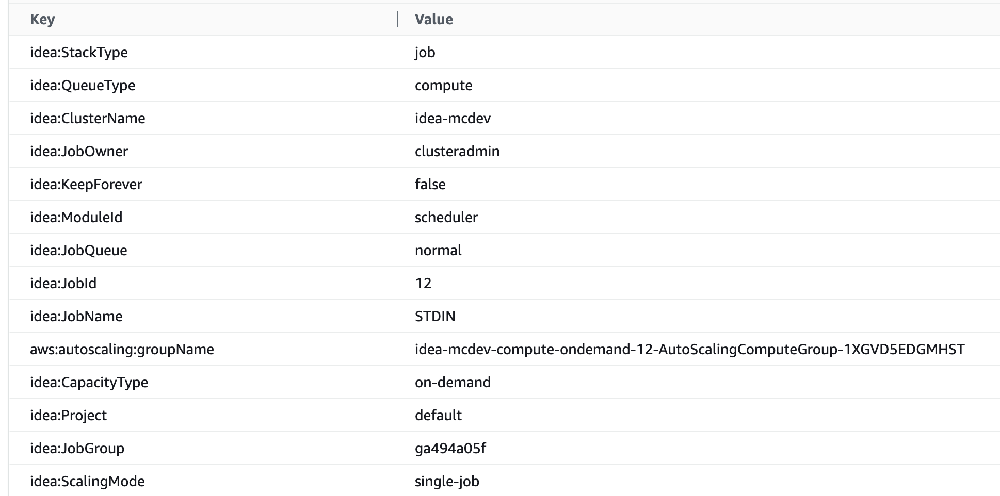
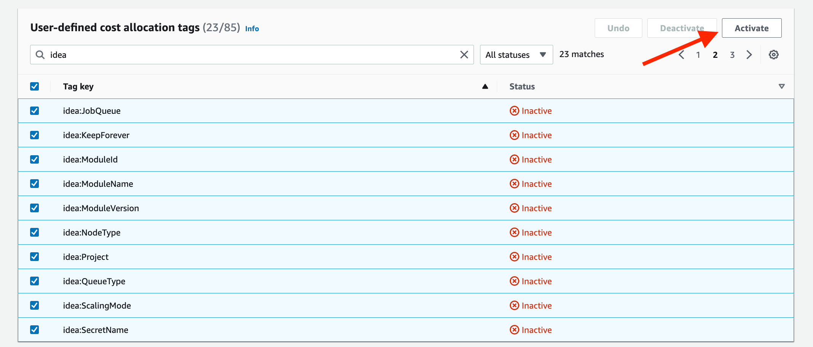

# Review your AWS spend

### AWS Cost Explorer 

Any EC2 resource launched by IDEA comes with an extensive list of EC2 tags that can be used to get detailed information about your cluster usage. List includes (but not limited to):

* Project Name
* Job Owner
* Job Name
* Job Queue
* Job Id

<figure><figcaption>
IDEA automatically assign tags. Custom tags can be added as needed
</figcaption></figure>


All IDEA generated tags are prefixed with "**idea:**"


#### Step1: Enable Cost Allocation Tags 


This step cannot be done from the account IDEA runs in if that account is a member of an AWS
Organization. AWS is explicit: "Only the management account in an organization and single accounts
that aren't members of an organization have access to the **cost allocation tags** manager in the
Billing console." A member account has no Cost allocation tags page, so somebody with access to the
management account has to activate the `idea:` tag keys.

IDEA cannot do this for you, and nothing fails loudly when it has not been done. Until the tag keys
are active, `idea:` tags do not appear in AWS Cost Explorer and a budget filtered on them reads as no
spend, which looks the same as a project that has not spent anything.

Tag keys can take up to 24 hours to appear on the cost allocation tags page, and up to another 24
hours to activate after that. Activation is not retroactive: costs incurred before the key was
active are not attributed to it unless the management account requests a backfill.


Click on your account name (top right on the screen) then click "**Billing Dashboard**". Once connected to your Billing dashboard, click "**Cost Allocation Tags**" on the left sidebar.

Search all "**idea**" tags then click "Activate". Status of each tag should now be changed to "Active".

<figure><figcaption>
Activate all tags to be usable on Cost Explorer
</figcaption></figure>

#### Step 2: Query Cost Explorer 


It could take up to 24 hours for the tags to be visible on Cost Explorer.


Access "**AWS Cost Explorer**" service via the EC2 console the click "**Cost Explorer**" on the left sidebar.

Open your Cost Explorer tab and specify your filters. In this example I want to get the EC2 cost (1), group by day for my queue named "cpus" (2).

To get more detailed information, select 'Group By' and apply additional filters. Here is an example if I want user level information for "cpus" queue Click "Tag" section under "Group By" horizontal label (1) and select "idea:JobOwner" tag. Your graph will automatically be updated with a cost breakdown by users for "cpus" queue

