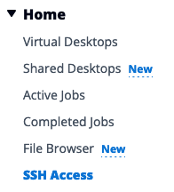
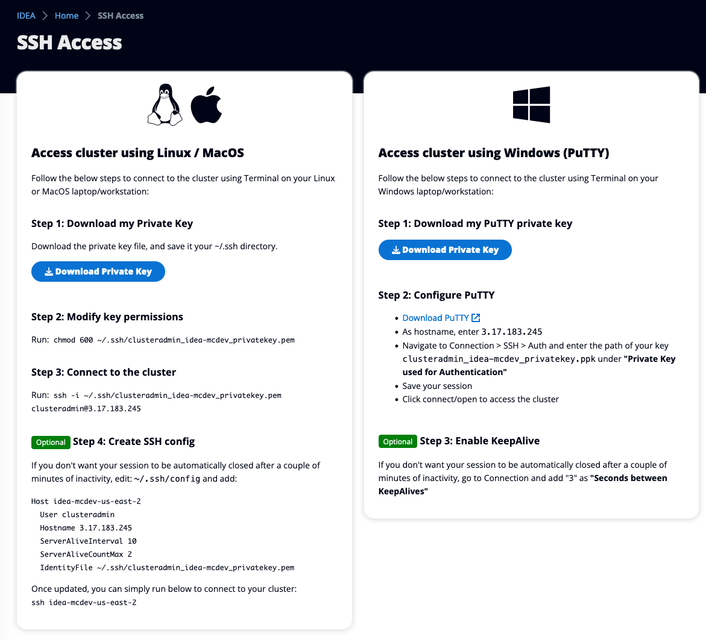

# SSH

If needed, you can SSH to the bastion host. First open your IDEA [web-interface.md](web-interface.md "mention") and click "**SSH access**" session on the left sidebar

<figure><figcaption></figcaption></figure>

IDEA will offers you two ways to establish an SSH connection. Follow the instructions displayed on the screen whether you are planning to use a regular SSH client or PuTTY (Windows)

<figure><figcaption>
Follow the instructions to configure your SSH client
</figcaption></figure>
