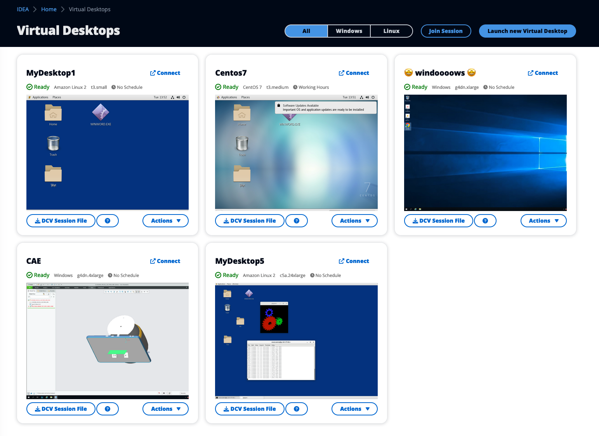

# Virtual Desktops (Linux/Windows)

Another way to interact with your IDEA environment is via Linux or Windows virtual desktops.

Refer to [virtual-desktop-interfaces](../../modules/virtual-desktop-interfaces/ "mention") module to learn more about desktops provisioning.

<figure><figcaption>
Easily provision Linux or Windows virtual desktop
</figcaption></figure>
