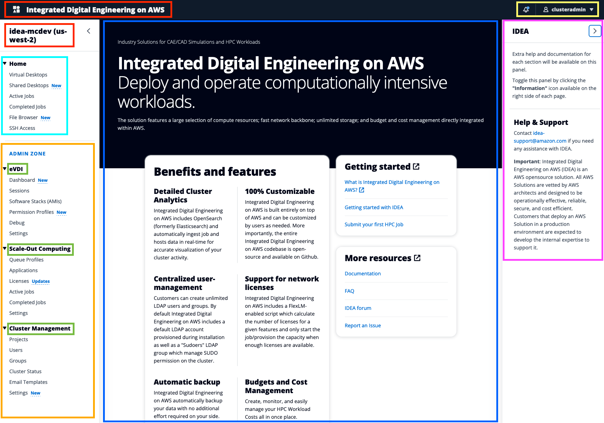

# Web Interface

IDEA includes a web-interface designed to simplify user-experience for your end-users.

<figure><figcaption>
IDEA interface
</figcaption></figure>

<mark style="color:red;">**Red**</mark>: Logo/Cluster (can be customized)

<mark style="color:blue;">**Light Blue**</mark>: User Menu.Options may vary based on the module(s) installed on your environment. For example, "Virtual Desktops" is not visible if you do not have installed [virtual-desktop-interfaces](../../modules/virtual-desktop-interfaces/ "mention") module

<mark style="color:blue;">**Dark Blue**</mark>: Page content

<mark style="color:orange;">**Orange**</mark>: Admin Zone. This section is only visible to users with admin privileges

<mark style="color:green;">**Green**</mark>:  [Broken link](broken-reference "mention") section displaying installed/available modules such as:

* [hpc-workloads](../../modules/hpc-workloads/ "mention")
* [virtual-desktop-interfaces](../../modules/virtual-desktop-interfaces/ "mention")
* [cluster-manager](../../modules/cluster-manager/ "mention")

Refer to the [Broken link](broken-reference "mention") for an up-to-date list of modules supported by IDEA

<mark style="color:yellow;">**Yellow**</mark>: User settings and notifications. View account info, change IDEA preferences, reset your password and more.

<mark style="color:purple;">**Purple**</mark>: Help section. You can hide/show this section as needed by clicking on the toggle button
