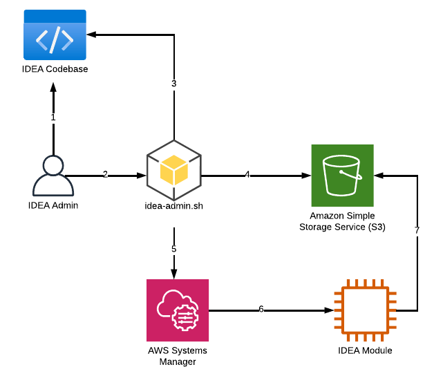

# Patch IDEA module (idea-admin.sh patch)


Use the **Patch** command  if you have updated the codebase of one of your module (e.g: developed new API, updated a function/class). Refer to [update-idea-configuration.md](update-idea-configuration.md "mention") for other types of updates.


To patch/update one IDEA module, run the following `idea-admin.sh patch <MODULE_NAME>`  command.

## Pre-Requisite

You must have completed your [developer-onboarding.md](../../../developer-portal/developer-onboarding.md "mention") and generated the local `dist` archives by running `invoke clean build package`

You also must be running this command on a system that has the permission to upload objects into the s3 bucket created during the CDK bootstrap phase.

## Workflow

<figure><figcaption>
Patch process
</figcaption></figure>

1. IDEA admin clones the latest IDEA codebase locally. Onboard to [developer-onboarding.md](../../../developer-portal/developer-onboarding.md "mention")and run `invoke clean build package` to create the latest `dist` archives
2. IDEA admin triggers `idea-admin.sh patch <MODULE> --aws-region <REGION> --cluster-name <CLUSTER_NAME>`
3. idea-admin.sh will retrieve the latest `dist` archive(s) (inside the `dist` folder generated during the `invoke clean build` package command)
4. idea-admin.sh will upload the `dist` file(s) to the S3 bucket created by the `cdk bootstrap` command during the installation of IDEA
5. idea-admin.sh will trigger AWS System Manager (SSM)
6. &#x20;AWS SSM triggers a `run-command` on the EC2 machine running the IDEA module you are planning to update
7. EC2 machine will download the `dist` archive(s) from S3, install it and then restart the relevant IDEA services

## Example: Updating the `cluster-manager` module of a running IDEA environment

<pre class="language-bash"><code class="lang-bash"># This guide assume your local system followed Developer Onboarding guide 
# # # # # # # # # # # # # # # # # # # 
<strong>#                                   #
</strong><strong># 1. Generate the dist package.     #
</strong><strong>#                                   #
</strong><strong># # # # # # # # # # # # # # # # # # # 
</strong><strong>$ invoke clean build package
</strong>------------------------------------------------------------------------------------------------------------------------
* begin: clean all
------------------------------------------------------------------------------------------------------------------------
....
[OUTPUT TRUNCATED]
....
removing 'idea-data-model-3.0.0' (and everything under it)
copying data-model artifacts ...
copying idea-virtual-desktop-controller artifacts ...
creating archive ...
distribution created: idea-virtual-desktop-controller-3.0.0.tar.gz
------------------------------------------------------------------------------------------------------------------------
* package idea-dcv-connection-gateway
------------------------------------------------------------------------------------------------------------------------
copying idea-dcv-connection-gateway artifacts ...
creating archive ...
distribution created: idea-dcv-connection-gateway-3.0.0.tar.gz

------------------------------------------------------------------------------------------------------------------------
* end: package all
------------------------------------------------------------------------------------------------------------------------

# # # # # # # # # # # # # # # # # # # 
#                                   #
# 2. Run the patch command          #
#                                   #
# # # # # # # # # # # # # # # # # # # 
$ ./idea-admin.sh patch cluster-manager \
   --aws-region us-east-2 \
   --cluster-name idea-prerc
   
searching for applicable ec2 instances ...
+---------------------+----------------------------+-------------------------------------------+-------------+---------+
| Instance Id         | Instance Name              | Host Name                                 | Private IP  | State   |
+---------------------+----------------------------+-------------------------------------------+-------------+---------+
| i-0f45cb&#x3C;REDACTED> | idea-prerc-cluster-manager | ip-10-0-211-98.us-east-2.compute.internal | 10.0.211.98 | running |
+---------------------+----------------------------+-------------------------------------------+-------------+---------+
? Are you sure you want to patch the above running ec2 instances for module: cluster-manager? Yes
uploading package: /Users/mcrozes/Solution-for-scale-out-computing-on-aws/dist/idea-cluster-manager-3.0.0.tar.gz to 
s3://idea-prerc-cluster-us-east-2-&#x3C;REDACTED>/idea/patches/idea-cluster-manager-3.0.0.tar.gz ...
patch command: sudo /bin/bash /root/bootstrap/latest/cluster-manager/install_app.sh s3://idea-prerc-cluster-us-east-2-&#x3C;REDACTED>/idea/patches/idea-cluster-manager-3.0.0.tar.gz >> 
/root/bootstrap/logs/patch.log
Patch execution status for SSM Command Id: 090070ee-aa2a-4bb6-b332-220f90aabfb7
+---------------------+----------------------------+-------------------------------------------+-------------+---------+--------------+
| Instance Id         | Instance Name              | Host Name                                 | Private IP  | State   | Patch Status |
+---------------------+----------------------------+-------------------------------------------+-------------+---------+--------------+
| i-0f45cb&#x3C;REDACTED> | idea-prerc-cluster-manager | ip-10-0-211-98.us-east-2.compute.internal | 10.0.211.98 | running | Success      |
+---------------------+----------------------------+-------------------------------------------+-------------+---------+--------------+
Patch executed successfully. Please verify the patch functionality as per release notes / change log.

</code></pre>


`invoke clean build package` can take some time as IDEA will generate the `dist` builds for all modules. You can speed up the process by manually specify which package you want to build by specify the package name:

`invoke devtool.build -m <MODULE>`

