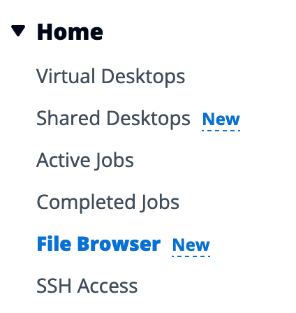
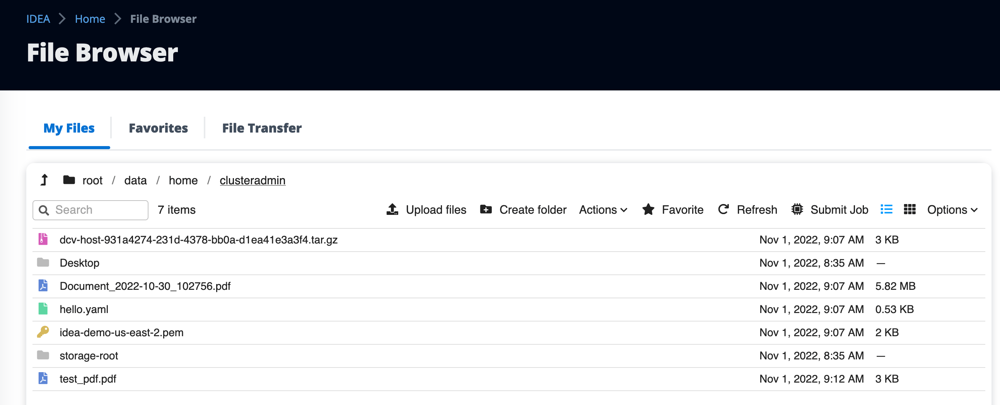
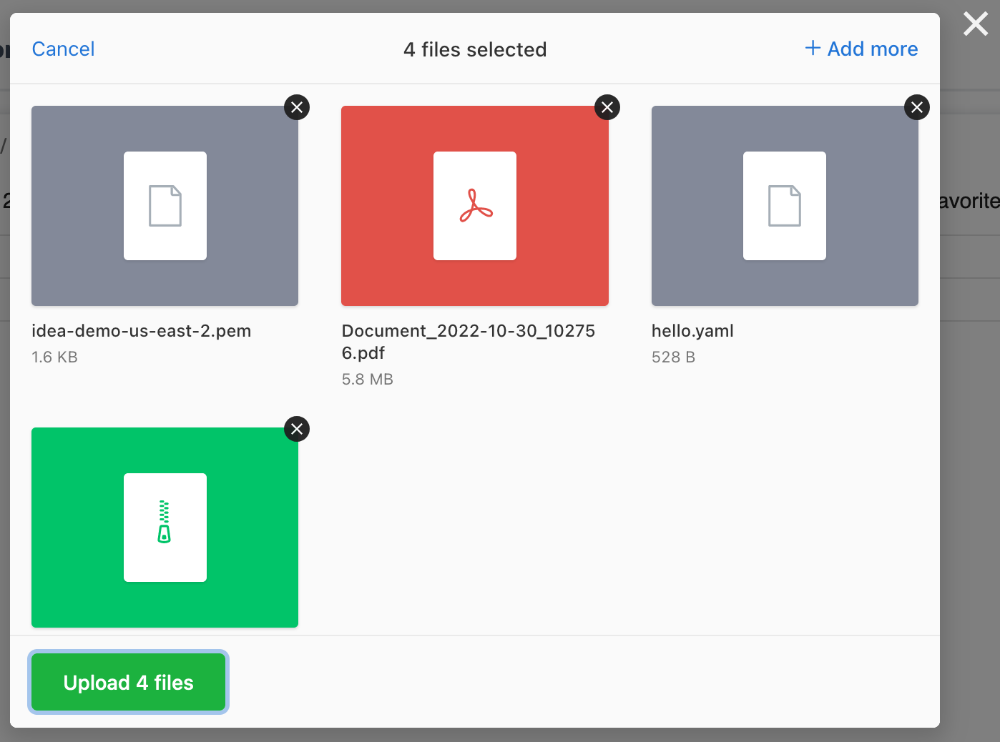
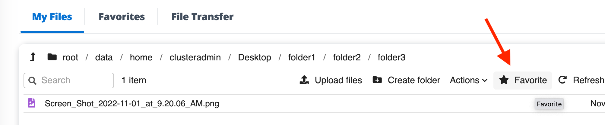
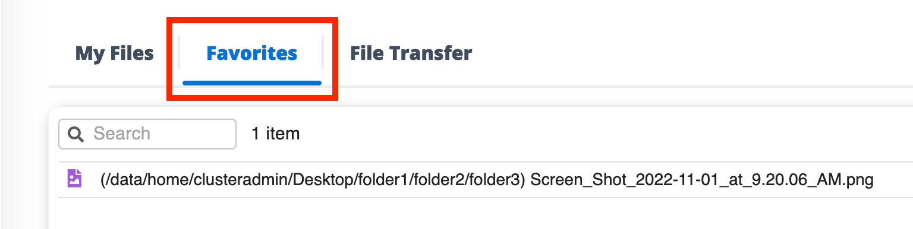
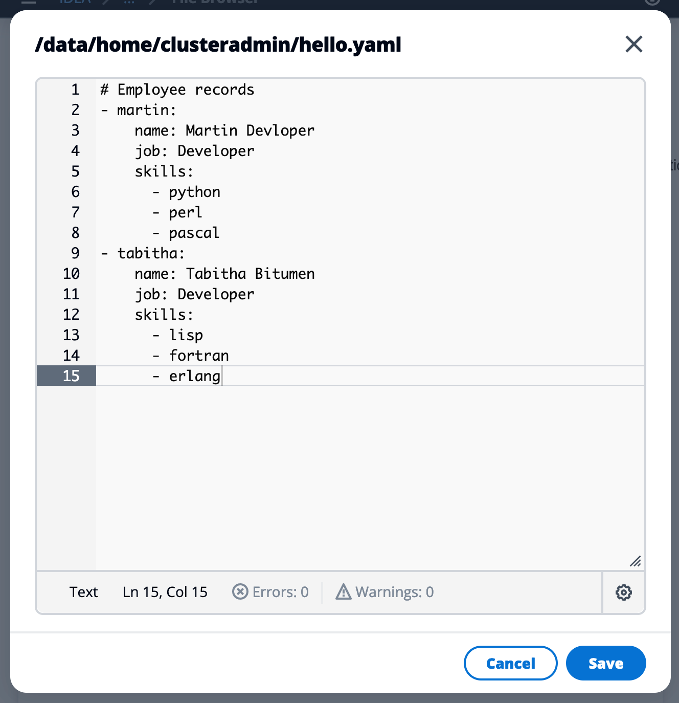
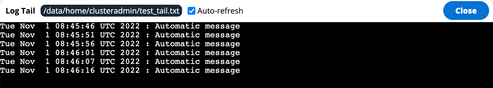

# File Browser

To access it this section, click "**File Browser**" on the left sidebar.

<figure><figcaption></figcaption></figure>

This will open a new interface from where you can manage all files available on the underlying file-system.

<figure><figcaption>
File Browser Interface
</figcaption></figure>


The file browser runs as you and honors filesystem permissions. System directories such as `/etc`, `/tmp`, `/usr` and `/var` are refused outright, whatever their permissions, and so is any path containing `..`.


## Distributed Storage

Backend storage (EFS/FSxL) is available on all Linux nodes. FSxOnTAP is available on all Linux + Windows nodes.

Updating a file via your virtual desktop is the same as updating a file via a terminal or via the web-based file browser.

## Move around

The path above the listing is a trail of clickable ancestors, starting at **root**. Click any segment to jump there.

To go somewhere directly, click the empty space to the right of the trail, type an absolute path, and press Enter. Escape cancels. The path must start with `/` and cannot contain `..`. The current directory is also in the page URL, so a directory can be bookmarked or shared as a link.

**Search** filters the current directory by name as you type. It does not search subdirectories.

## Read the listing

Three columns: **Name**, **Last modified** and **Size**. Click a column header to sort by it, and click again to reverse. Folders stay above files in every sort.

Directories are listed 100 rows to a page. If there are more, a pager appears below the table.

Files whose names start with a dot are hidden. Turn them on with **Show hidden files**, in the **View options** button at the end of the toolbar or at the bottom of the right-click menu. The setting resets when you reload the page.

## Select files

* Click a row to select it on its own.
* Ctrl-click (Cmd-click on macOS) a row to add it to, or remove it from, the selection.
* Shift-click a row to select everything between it and the row you clicked last.
* Double-click a row to open it: a folder opens in place, a file opens in the editor.
* Right-click for a context menu of the actions available for the current selection.


Selecting all with the header checkbox selects the 100 rows on screen, not the whole directory. To act on a larger directory, work through it a page at a time.


## Upload file(s)

To upload, click "**Upload files**". In the window that opens, drag & drop files or folders, or browse your local device. Once everything is selected, start the upload. The listing refreshes when it finishes.

<figure><figcaption>
Upload files
</figcaption></figure>

## Create a folder

Click "**Create folder**" and enter a name. The folder is created in the directory you are looking at.

## Rename file(s)

Select one or more entries and click "**Rename**". The modal lists every selected item with its current name and a field for the new one. Entries you are not allowed to rename, and protected entries, are shown as such with their fields disabled.

## Delete file(s)

Select the file(s) you want to delete and click "**Actions**" > "**Delete files**". Alternatively, you can right-click to display the context menu and click "**Delete files**". The confirmation lists everything that will go.

## Download file(s)

Select what you want and click "**Actions**" > "**Download files**". A directory, or a selection of several files, is delivered as a single archive.

## Copy a path

"**Actions**" > "**Copy selection**" puts the absolute path of the selected entry on your clipboard, ready to paste into a terminal or a job script.

## Manage your Favorites

You can pin your favorites file(s)/folder(s). To do so, select the file/folder you want to add to favorite then click "**Favorite**" . Alternatively, you can right-click to display the context menu and click "**Favorite** "

<figure><figcaption>
Click Favorite button to favorite a location
</figcaption></figure>

Then navigate to the "Favorites" tab to quickly access it.

<figure><figcaption>
Easy way to access your favorites (file/folders)
</figcaption></figure>


Favorites are stored on the local browser, per cluster and per user. You will need to re-pin all favorites if you change your browser or clear the cache.


## Edit file(s)

For text based files, you can directly edit the content via the web-interface. Double-click the file you want to update, or select it and click "**Actions**" > "**Open**", and a new modal will be displayed with the content of the file. Make your edits then click "**Save**".

<figure><figcaption>
Edit a file using the built-in editor
</figcaption></figure>


The editor opens text files up to 5 MB. A larger file, or a binary file, downloads instead of opening.


"**Actions**" > "**Open in Script Workbench**" sends the same file to the [script-workbench.md](../modules/hpc-workloads/user-documentation/script-workbench.md "mention") instead, under the same 5 MB limit.

## Tail files in real-time

IDEA also offers you the ability to tail the content of a file in real-time. Right-Click on any text-based file then select "**Tail File**" from the context menu.

This will open a new window where the content of your file will automatically be displayed without you having to re-open the file. This behavior is similar to `tail -f` command on linux.

<figure><figcaption>
Tail a file in real-time.
</figcaption></figure>

The window polls every ten seconds and stops on its own once the file has been quiet for a while. Reopen it to start again.

## Submit a job

You can select a file to be used as input file for one of your [hpc-workloads](../modules/hpc-workloads/ "mention").

Select your file and click "**Submit Job**" in the toolbar. Alternatively, you can right-click to display the context menu and click "**Submit** **Job**". The button appears only when a scheduler is deployed on the cluster. On the **Favorites** tab, Submit Job is under "**Actions**".
