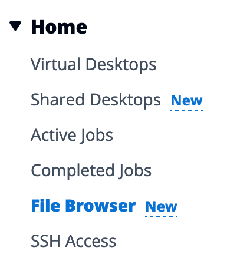

# File Browser

To access it this section, click "**File Browser**" on the left sidebar.

<figure><figcaption></figcaption></figure>

This will open a new interface from where you can manage all files available on the underlying file-system.

<figure><figcaption>
File Browser Interface
</figcaption></figure>


Web-based file browser honors filesystem permissions.


## Distributed Storage

Backend storage (EFS/FSxL) is available on all Linux nodes. FSxOnTAP is available on all Linux + Windows nodes.

Updating a file via your virtual desktop is the same as updating a file via a terminal or via the web-based file browser.

## Upload file(s)

To upload a file, click "**Upload Files**" then either drag & drop files or browse your local device. Once all the files are selected, click "**Upload (N) Files**"

<figure><figcaption>
Upload files
</figcaption></figure>

## Delete file(s)

Select the file(s) you want to delete and click "**Actions**" > "**Delete Files**". Alternatively, you can right-click to display the context menu and click "**Delete** **Files**"

## Manage your Favorites

You can pin your favorites file(s)/folder(s). To do so, select the file/folder you want to add to favorite then click "**Favorite**" . Alternatively, you can right-click to display the context menu and click "**Favorite** "

<figure><figcaption>
Click Favorite button to favorite a location
</figcaption></figure>

Then navigate to the "Favorites" tab to quickly access it.

<figure><figcaption>
Easy way to access your favorites (file/folders)
</figcaption></figure>


Favorites are stored on the local browser. You will need to re-pin all favorites if you change your browser or clear the cache.


## Edit file(s)

For text based files, you can directly edit the content via the web-interface. Click on the file you want to update and a new modal will be displayed with the content of the file. Make your edits then click "**Save**".

<figure><figcaption>
Edit a file using the built-in editor
</figcaption></figure>

## Tail files in real-time

IDEA also offers you the ability to tail the content of a file in real-time. Right-Click on any text-based file then select "**Tail File**" from the context menu.

This will open a new window where the content of your file will automatically be displayed without you having to re-open the file. This behavior is similar to `tail -f` command on linux.

<figure><figcaption>
Tail a file in real-time.
</figcaption></figure>

## Submit a job

You can select a file to be used as input file for one of your [hpc-workloads](../modules/hpc-workloads/ "mention").

Select your file and click "**Actions**" > "**Submit Job**". Alternatively, you can right-click to display the context menu and click "**Submit** **Job**"
