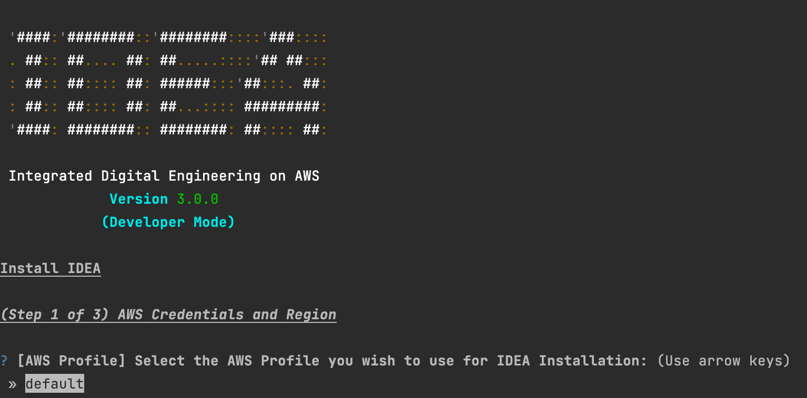
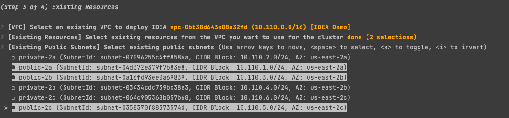
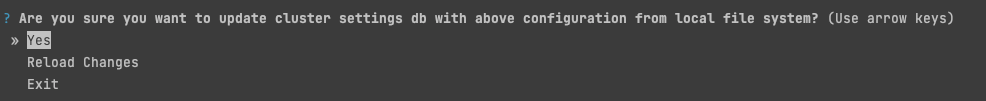
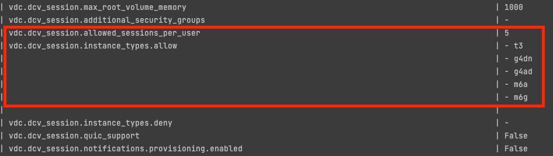
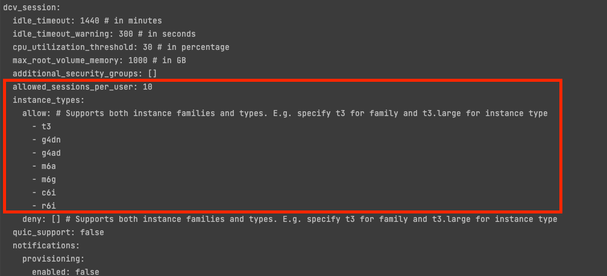
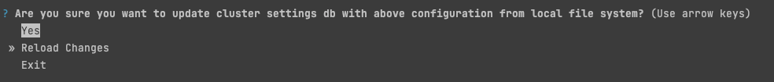
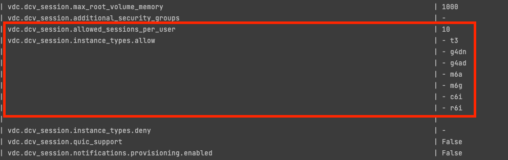

# Standard Installation


Review [pre-requisites.md](pre-requisites.md "mention") section first


## Install IDEA from scratch



**Option 1: Automatic installation**

Copy/Paste this command on your terminal to launch the installation

```sh
git clone https://github.com/cfs-energy/idea
cd idea
./idea-admin.sh quick-setup
```

**Option 2: Download the installer and execute it manually**

As an alternative, you can download `idea-admin.sh` via this [https://raw.githubusercontent.com/cfs-energy/idea/main/idea-admin.sh](https://raw.githubusercontent.com/cfs-energy/idea/main/idea-admin.sh) and execute it on your Linux or Mac environment via `/bin/bash idea-admin.sh quick-setup`



Installation of IDEA in Windows is managed by Powershell. Download and execute the following script on your local Windows workstation:

Note: This will only work on Windows 10/11 as Windows Server lacks support for Linux Containers.

```powershell
git clone https://github.com/cfs-energy/idea
cd idea
./idea-admin-windows.ps1 quick-setup
```




./idea-admin.sh utility offers many features. Refer to [idea-cli-utility.md](../../developer-portal/idea-cli-utility.md "mention") for more details.


Follow the installation wizard to install IDEA. During the installation, you will be prompted for various AWS parameters.

`quick-setup` proceed to a brand new deployment, if you are looking to re-use existing AWS resources running on your AWS environment (VPC, subnets ..), refer to [#install-idea-using-existing-aws-resources](standard-installation.md#install-idea-using-existing-aws-resources "mention").


Run `export IDEA_ADMIN_AWS_CREDENTIAL_PROVIDER=Ec2InstanceMetadata` prior to `quick-setup` if you are planning to authenticate to AWS using IAM role and not IAM user.


<figure><figcaption><p>Installation of IDEA is managed by a wizard.</p></figcaption></figure>

Installation will take anywhere between 30 to 80 minutes depending the module(s) you are planning to install. Connection strings will be displayed at the end of the installation

```
checking endpoint status for cluster: idea-test, url: https://idea-test-external-alb-1837136939.us-east-2.elb.amazonaws.com ...
+------------------------------+---------------------------------------------------------------------------------------------------+---------+
| Module                       | Endpoint                                                                                          | Status  |
+------------------------------+---------------------------------------------------------------------------------------------------+---------+
| Cluster Manager              | https://idea-test-external-alb-1837136939.us-east-2.elb.amazonaws.com/cluster-manager             | SUCCESS |
| eVDI                         | https://idea-test-external-alb-1837136939.us-east-2.elb.amazonaws.com/vdc                         | SUCCESS |
| Scale-Out Computing          | https://idea-test-external-alb-1837136939.us-east-2.elb.amazonaws.com/scheduler                   | SUCCESS |
| OpenSearch Service Dashboard | https://idea-test-external-alb-1837136939.us-east-2.elb.amazonaws.com/_dashboards/                | SUCCESS |
+------------------------------+---------------------------------------------------------------------------------------------------+---------+
```

### Resume installation in case of failure

IDEA deployment creates multiple stacks based on modules selected for deployment. The total time of deployment can range anywhere between 40 mins to 1.5 hours.

After a CloudFormation stack is deployed for a module, the status of each module maintained in DynamoDB changes from **not-deployed** → **deployed**.

You can check the deployment status per module by running:

```
./idea-admin.sh list-modules  \
  --cluster-name <CLUSTER_NAME> \
  --aws-region <REGION>
 
# example:
./idea-admin.sh list-modules --cluster-name idea-dev1 --aws-region us-east-1
+----------------------------+------------------+--------+----------------------------+--------------+----------+
| Name                       | Module ID        | Type   | Stack Name                 | Version      | Status   |
+----------------------------+------------------+--------+----------------------------+--------------+----------+
| metrics                    | metrics          | stack  | idea-dev1-metrics          | 3.0.0-beta.1 | deployed |
| cluster-manager            | cluster-manager  | app    | idea-dev1-cluster-manager  | 3.0.0-beta.1 | deployed |
| directoryservice           | directoryservice | stack  | idea-dev1-directoryservice | 3.0.0-beta.1 | deployed |
| virtual-desktop-controller | vdc              | app    | idea-dev1-vdc              | 3.0.0-beta.2 | deployed |
| cluster                    | cluster          | stack  | idea-dev1-cluster          | 3.0.0-beta.2 | deployed |
| scheduler                  | scheduler        | app    | idea-dev1-scheduler        | 3.0.0-beta.1 | deployed |
| global-settings            | global-settings  | config | -                          | -            | deployed |
| analytics                  | analytics        | stack  | idea-dev1-analytics        | 3.0.0-beta.1 | deployed |
| bastion-host               | bastion-host     | stack  | idea-dev1-bastion-host     | 3.0.0-beta.1 | deployed |
+----------------------------+------------------+--------+----------------------------+--------------+----------+
```

If you encounter any errors during deployment, in one of the stacks, the default behavior is to rollback the deployment for that particular stack. Try to investigate the cause of the problem using the Event log displayed by CDK.

If you are able to identify and fix the problem, you can safely run the below command to re-trigger the installation. Process will resume automatically after the last known operation:

```
./idea-admin.sh deploy all \
  --cluster-name <CLUSTER_NAME> \
  --aws-region <REGION>
```

If only one module has failed, you can run `./idea-admin.sh deploy <MODULE_NAME>` directly.

## Install IDEA using existing AWS resources

As an alternative, you can install IDEA using existing resources running on your AWS environment such as VPC, Subnets, Filesystems, OpenSearch clusters and more.

To enable this mode, use `--existing-resources` as shown below:

```bash
./idea-admin.sh quick-setup --existing-resources
```

IDEA installer will guide you through the entire process during Step 3

<figure><figcaption><p>Select the resources you want to re-use via the installer CLI interface</p></figcaption></figure>

## Change default installation parameters

IDEA is 100% customizable and because of that, we cannot provide all the options via a single wizard. Follow these steps if you want to change the default parameters for any module.

1 - Proceed to the regular Installation via `idea-admin.sh quick-setup`

2 - Pause when the installer prompt you with **"Are you sure you want to update cluster settings db with above configuration from local file system?"**

<figure><figcaption><p>Pause your installation and open a new terminal to edit the configuration</p></figcaption></figure>

At this point, open a new terminal and navigate to `` ~/.idea/clusters/<YOUR_CLUSTER_NAME>/<YOUR_REGION>/` ``

You should see `` `values.yml` `` and a `` `config` `` folder. `config` contains all settings which are module specific

```bash
ls ~/.idea/clusters/idea-test/us-east-2/config/
analytics		directoryservice	metrics
bastion-host		global-settings		scheduler
cluster			idea.yml		shared-storage
cluster-manager		identity-provider	vdc
```

3 - Update your parameter(s)

In this example, we will show you how to update the following parameters:

* vdc.dcv\_session.allowed\_sessions\_per\_user: Number of virtual desktops per user (default to 5)
* vdc.dcv\_session.instance\_types.allow: Control what type of EC2 instance can be provisioned as virtual desktops by the end users (default to t3, g4dn, g4ad, m6a and m6g).

The screen below (generated during `idea-admin.sh quick-setup` ) reports the default values for both sessions

<figure><figcaption></figcaption></figure>

To update these parameters, edit \``` ~/.idea/clusters/<YOUR_CLUSTER_NAME>/<YOUR_REGION>/config/vdc/settings.yml` `` and update the relevant keys.

<figure><figcaption><p>Increased the number of allowed sessions and added c6i and r6i</p></figcaption></figure>

4 - Reload the installer configuration

Go back to your IDEA installer and choose "Reload Changes"

<figure><figcaption><p>Reload the configuration after making your changes</p></figcaption></figure>

5 - Validate the installer will now use your new parameter(s)

Reloading configuration should take less than 5 seconds. Once done, validate your parameter(s) is/are have been successfully updated. The screen below confirm "vdc.dcv\_session.allowed\_sessions\_per\_user" and "vdc.dcv\_session.instance\_types.allow" have been correctly updated with my changes.

<figure><figcaption><p>IDEA will now configure the environment with your changes</p></figcaption></figure>

6 - Continue the installation

You can now move forward with the installer by choosing "Yes".


IDEA parameters always use the same syntax: module.section.key.

Example:

If you want to update **scheduler.ec2.enable\_detailed\_monitoring,** you will have to edit \`\` \~/.idea/clusters/\<YOUR\_CLUSTER\_NAME>/\<YOUR\_REGION>/config/**scheduler**/settings.yml and find `enable_detailed_monitoring` key within the `ec2` section.


You can also change these settings post-installation. Refer to [cluster-operations](../cluster-operations/ "mention")for more details.
