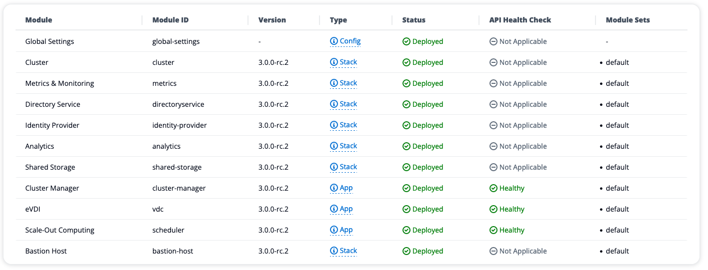
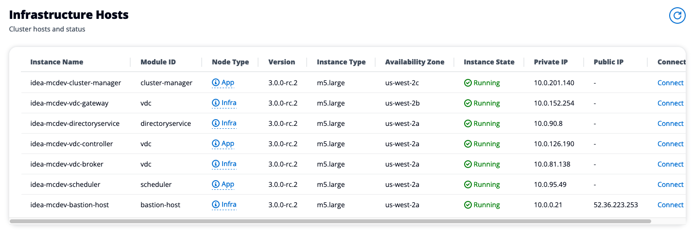

# Cluster Status

Check the version of each modules installed as well as their relevant module sets

<figure><figcaption>
List of modules installed on the IDEA cluster
</figcaption></figure>

Review the EC2 instances where the infrastructure is hosted. Each EC2 machine is configured with AWS Session Manager, meaning administrator with AWS account permission can 1-Click connect to the EC2 instance

<figure><figcaption>
Infrastructure hosts
</figcaption></figure>
