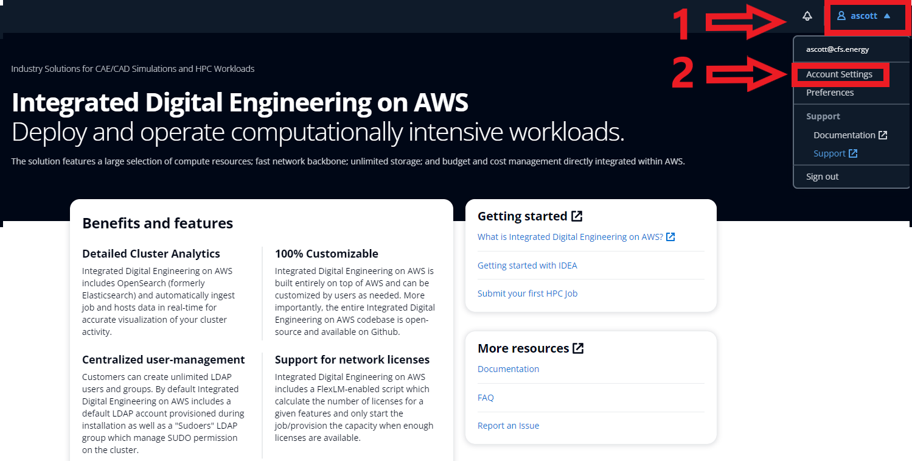
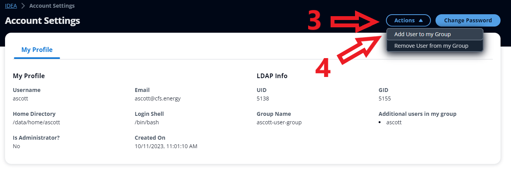
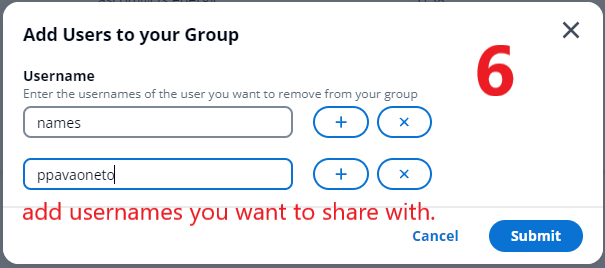
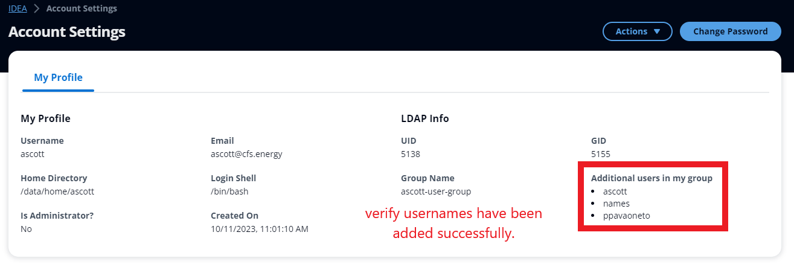
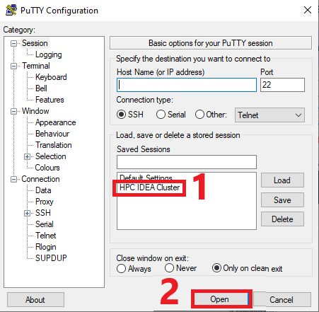
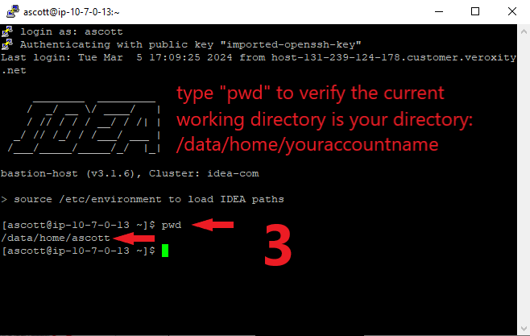
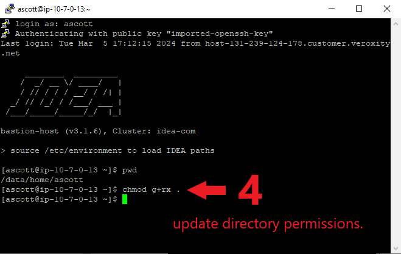
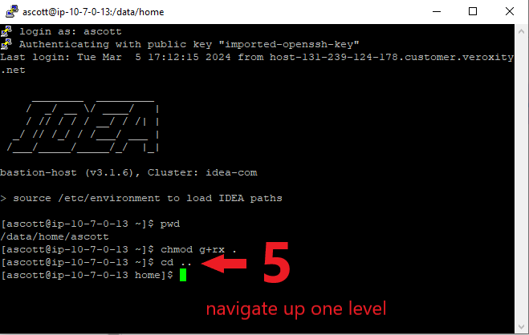
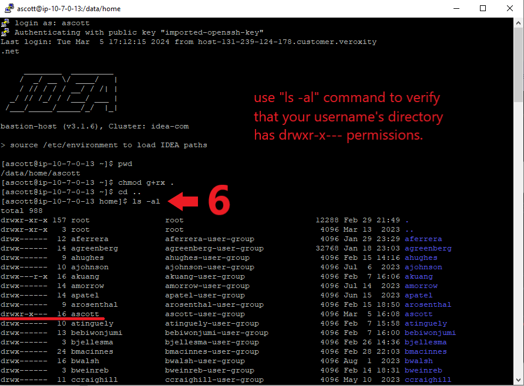

# Data Sharing Between Users

* Navigate to your IDEA cluster > account settings

<figure><figcaption></figcaption></figure>

* Click on the actions button > add user to my group

<figure><figcaption></figcaption></figure>

* Click the plus button to add users > type the usernames you want to share with

<figure><figcaption></figcaption></figure>

<figure><figcaption></figcaption></figure>

* Verify usernames have been added and are spelled correctly

<figure><figcaption></figcaption></figure>

* Open SSH client > connect to HPC IDEA Cluster. Note: If you haven't set this up yet, follow the tutorial here: [https://cidea.cfsenergy.com/#/home/ssh-access](https://cidea.cfsenergy.com/#/home/ssh-access)

<figure><figcaption></figcaption></figure>

&#x20;

* Ensure you are in your username's directory (use "pwd")

<figure><figcaption></figcaption></figure>

* Type "chmod g+rx ." (no quotes, don't forget the period) to update permissions for your username's directory

<figure><figcaption></figcaption></figure>

* Type "cd .." (no quotes) to navigate to the next level up in the directory hierarchy

<figure><figcaption></figcaption></figure>

* Type "ls -al" (no quotes) and verify your directory has "drwxr-x---" permissions

<figure><figcaption></figcaption></figure>

Those who you've shared with should now be able to download files from your directory!

\
