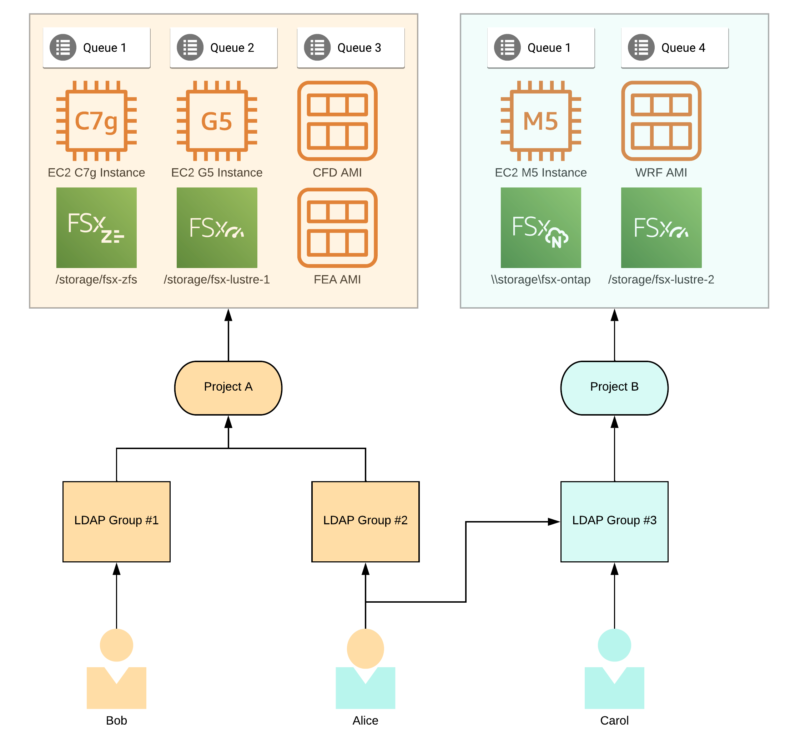
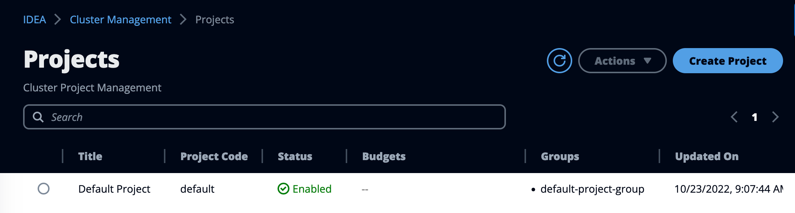
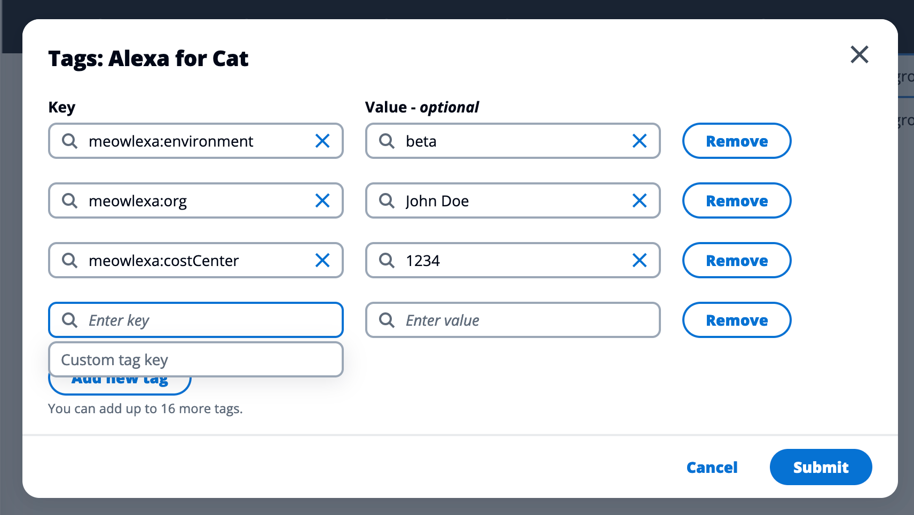

# Projects Management

Projects enforce access restriction and limitations on your IDEA cluster.

Projects in IDEA let you control access to queue profiles, virtual desktops provisioning, shared storage and more.

For the [hpc-workloads](../hpc-workloads/ "mention") module, projects control queues ACLs (user authorized to submit jobs) as well as web-based job submission forms at application level.

For the [virtual-desktop-interfaces](../virtual-desktop-interfaces/ "mention") module, projects control the type of EC2 instances that can be selected as well as the software stack (AMI) that can be provisioned by the users.

For [.](./ "mention") module, projects control what shared file-systems are mounted.

<figure><figcaption>
Example of AWS resources control at project level
</figcaption></figure>


You can add additional AWS tags per project. IDEA will automatically tag all AWS resources created by jobs/desktops using this project.


To create a new project, navigate to the **"Cluster Management**" section on the left sidebar of IDEA menu and click "**Projects**"

<figure><figcaption>
Projects section on IDEA
</figcaption></figure>

### Create a new project

To create a new project, click "**Create Project**" button located on the top right section. You will be asked to fill the following form:

* Title: Friendly name for your project.
* Code: Unique code for your project. You will reference your project on IDEA via this code.
* Description: Description of your project
* Groups: List of LDAP groups assigned to this project
* (Optional) AWS Budget: Link your group to an existing AWS Budget

By default, newly created projects are "Disabled". Refer to the section below to learn how to enable it.

### Enable a project

To enable a project:

1. Select a project where Status is set to Disabled
2. Click "**Actions**" > "**Enable Project**"

### Disable a project

To disable a project:

1. Select a project where Status is set to Enabled
2. Click "**Actions**" > " **Disable Project**"

### Add AWS tags

You can assign custom AWS tags to your project(s). IDEA will automatically try to tag all resources created while using this project. This includes ephemeral filesystems, virtual desktops or compute nodes. You can flag these tags as "Cost Allocation Tags" to get detailed budget information via AWS CostExplorer.

To add custom tags :

1. Select a project
2. Click "**Actions**" > "**Update Tags**"
3. Click "**Add New Tag**"

<figure><figcaption>
Example of additional AWS tags associated to an IDEA project
</figcaption></figure>

### Manage associated LDAP groups membership

You can at any time add/remove LDAP groups associated to a given IDEA project.

1. Select a project
2. Click "**Actions**" > "**Edit Project**"
3. Add or remove LDAP groups within the "Groups" section
