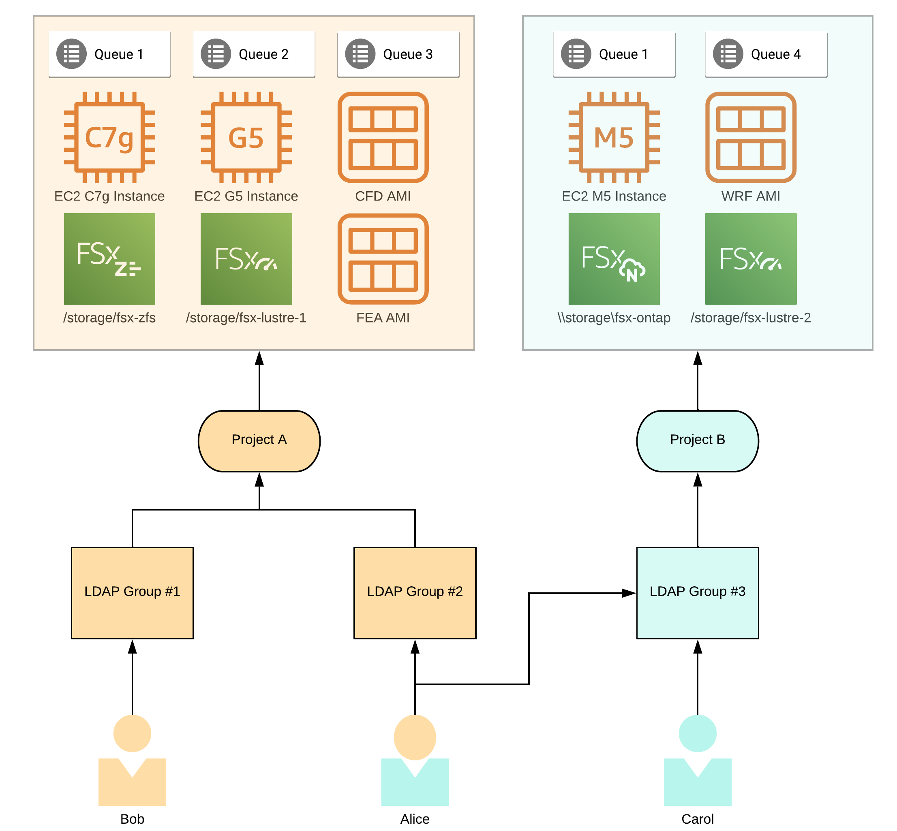
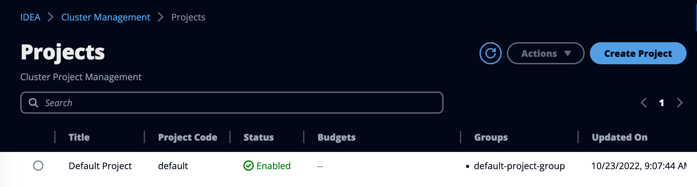
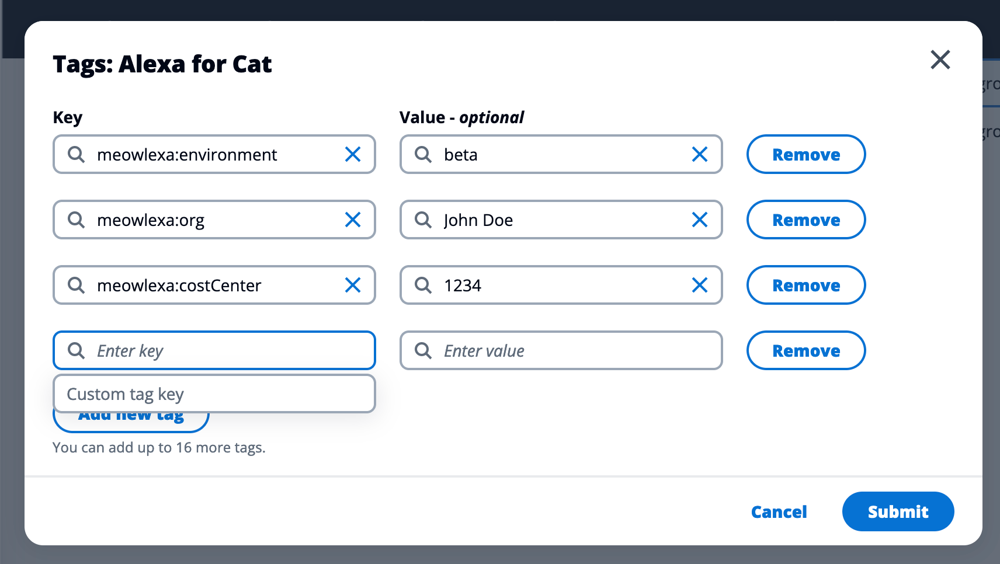

# Projects Management

Projects enforce access restriction and limitations on your IDEA cluster.

Projects in IDEA let you control access to queue profiles, virtual desktops provisioning, shared storage and more.

For the [hpc-workloads](../hpc-workloads/ "mention") module, projects control queues ACLs (user authorized to submit jobs) as well as web-based job submission forms at application level.

For the [virtual-desktop-interfaces](../virtual-desktop-interfaces/ "mention") module, projects control the type of EC2 instances that can be selected as well as the software stack (AMI) that can be provisioned by the users.

For [.](./ "mention") module, projects control what shared file-systems are mounted.

<figure><figcaption><p>Example of AWS resources control at project level</p></figcaption></figure>


You can add additional AWS tags per project. IDEA will automatically tag all AWS resources created by jobs/desktops using this project.


To create a new project, navigate to the **"Cluster Management**" section on the left sidebar of IDEA menu and click "**Projects**"

<figure><figcaption><p>Projects section on IDEA</p></figcaption></figure>

### Create a new project

To create a new project, click "**Create Project**" button located on the top right section. You will be asked to fill the following form:

* Title: Friendly name for your project.
* Code: Unique code for your project. You will reference your project on IDEA via this code.
* Description: Description of your project
* Groups: List of LDAP groups assigned to this project
* (Optional) AWS Budget: Link your group to an existing AWS Budget

By default, newly created projects are "Disabled". Refer to the section below to learn how to enable it.


### Enable a project

To enable a project:

1. Select a project where Status is set to Disabled
2. Click "**Actions**" > "**Enable Project**"


### Disable a project

To disable a project:

1. Select a project where Status is set to Enabled
2. Click "**Actions**" > " **Disable Project**"

### Add AWS tags

You can assign custom AWS tags to your project(s). IDEA will automatically try to tag all resources created while using this project. This includes ephemeral filesystems, virtual desktops or compute nodes. You can flag these tags as "Cost Allocation Tags" to get detailed budget information via AWS CostExplorer.

To add custom tags :

1. Select a project
2. Click "**Actions**" > "**Update Tags**"
3. Click "**Add New Tag**"

<figure><figcaption><p>Example of additional AWS tags associated to an IDEA project</p></figcaption></figure>

### Manage associated LDAP groups membership

You can at any time add/remove LDAP groups associated to a given IDEA project.

1. Select a project
2. Click "**Actions**" > "**Edit Project**"
3. Add or remove LDAP groups within the "Groups" section

### Amazon Bedrock for a project

Model access is granted per project, on top of a cluster-level switch. A project with Bedrock enabled runs its virtual desktops, and optionally its compute nodes, under an IAM role of its own, so every model call is attributed to that project.

#### Turn it on for the cluster

`cluster-manager.bedrock.enabled` is `false` out of the box, and nothing is provisioned while it is false. The model catalog `cluster-manager.bedrock.model_ids` ships empty by design: approving a model there subscribes the AWS account to that model's marketplace terms and pricing on first invocation, and model ids are region specific.

```bash
./idea-admin.sh config \
  set "Key=cluster-manager.bedrock.enabled,Type=bool,Value=true" \
  --cluster-name <CLUSTER_NAME> \
  --aws-region <REGION>
```

Deployment order and redeploys:

* Deploy virtual-desktop-controller first. A project role reuses that module's DCV host policy, and the reconcile fails while `virtual-desktop-controller.dcv_host_policy_arn` is unset.
* Toggling `cluster-manager.bedrock.enabled` requires a redeploy of both cluster-manager and virtual-desktop-controller.
* For HPC jobs, set `scheduler.bedrock.enabled` to `true` as well and redeploy the scheduler module, which writes `scheduler.bedrock.project_pass_role_arn`. Without it, jobs stay on the compute node role.
* Disable Bedrock on each project before disabling it for the cluster.

#### Enable it for a project

1. Select a project
2. Click "**Actions**" > "**Edit Project**"
3. Answer **Do you want to enable Amazon Bedrock for this project?**
4. Pick models under **Bedrock Models**, a multi-select fed by the cluster catalog

A project with Bedrock enabled and no model selected gets no access.

#### What gets created

Each reconcile brings the project's AWS resources in line with the project record:

* An IAM role named for the cluster and the project, carrying the permissions boundary the cluster-manager stack builds, `<cluster-name>-<region>-<module-id>-project-boundary`.
* An instance profile for that role, used by the project's virtual desktops and, when jobs are enabled, its compute nodes.
* One application inference profile per selected model.
* A customer managed policy allowing `bedrock:InvokeModel` and `bedrock:InvokeModelWithResponseStream` only through those profiles, plus `bedrock:GetInferenceProfile` on them and `bedrock:ListInferenceProfiles`.
* The same managed policies the shared DCV host role carries (the DCV host policy, AWS Systems Manager, the CloudWatch agent, and Amazon Managed Prometheus where it is the metrics provider), plus everything in `cluster.iam.ec2_managed_policy_arns`.
* Tags on all of it: `idea:ClusterName`, `idea:ModuleId`, `idea:Project`, the project's own tags, and `global-settings.custom_tags`.


Activate `idea:Project` under **Billing** > **Cost allocation tags** for Bedrock spend to reach the project's budget. See [ai-usage-tracking.md](ai-usage-tracking.md "mention").


A policy listed in `cluster.iam.ec2_managed_policy_arns` that the permissions boundary does not allow in full is not attached to the project role, and the reason is recorded against the project.

#### When the reconcile runs

The reconcile is queued as a task, not run inline, so a save returns before its AWS resources exist. It runs on:

* saving a project
* enabling or disabling a project
* writing `cluster-manager.bedrock.enabled` or `cluster-manager.bedrock.model_ids`, which reconciles every project that carries a Bedrock block

Turning Bedrock off, for the cluster or for one project, tears down what was provisioned for it. Disabling a project does the same.

#### Where errors show

Two maps are recorded on the project record and returned by the Projects API to administrators:

| Field | Holds |
| --- | --- |
| `bedrock.model_errors` | Model id to the reason that model got no access. |
| `bedrock.policy_errors` | Policy ARN to the reason an administrator supplied policy is not on the project role, or could not be checked against the boundary. |

Common reasons: the model is not in the cluster catalog; the model cannot be routed from the cluster's region and partition; or the provisioner itself was denied, which means cluster-manager needs a redeploy so its role carries the Bedrock provisioner permissions. Every one of them is also logged by cluster-manager. Members see `bedrock.model_errors` for their own projects; `policy_errors` names administrator policies and is withheld from them.

A model listed on a project with no inference profile ARN next to it reads **Not provisioned yet** and becomes usable once the reconcile completes.

#### The Claude Code setup wizard shows red

Its Bedrock check lists the account's system inference profiles and tests each one, and every candidate comes back without `InvokeModel` permission. That is correct: a project is granted its own application inference profiles rather than the shared system ones, which is what keeps spend tagged to the project. A wizard that goes green means something is invoking a shared profile and the spend is attributed to no project. Tell users to skip it.
