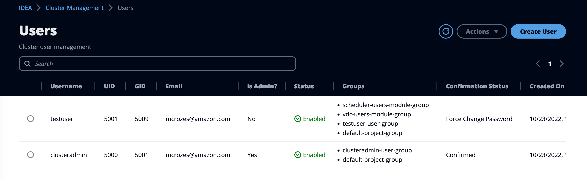
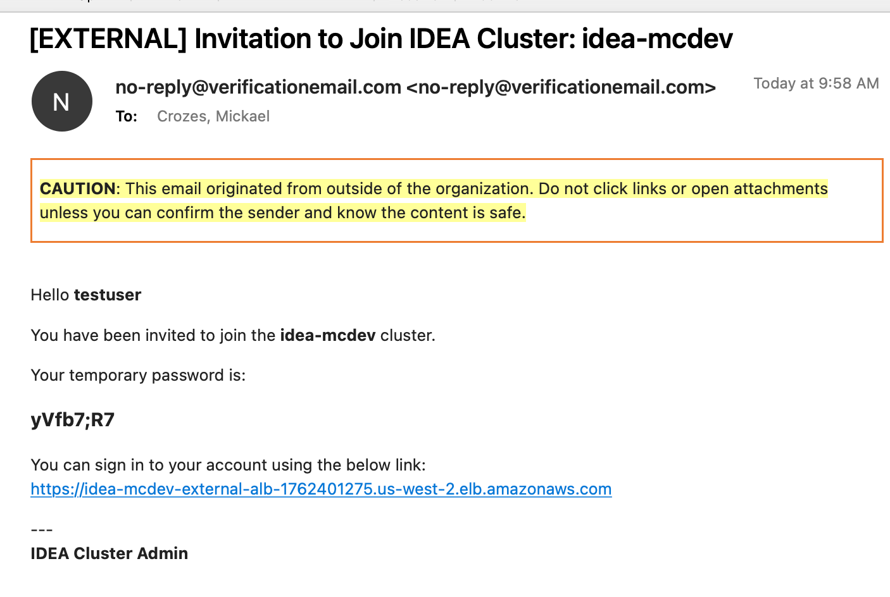
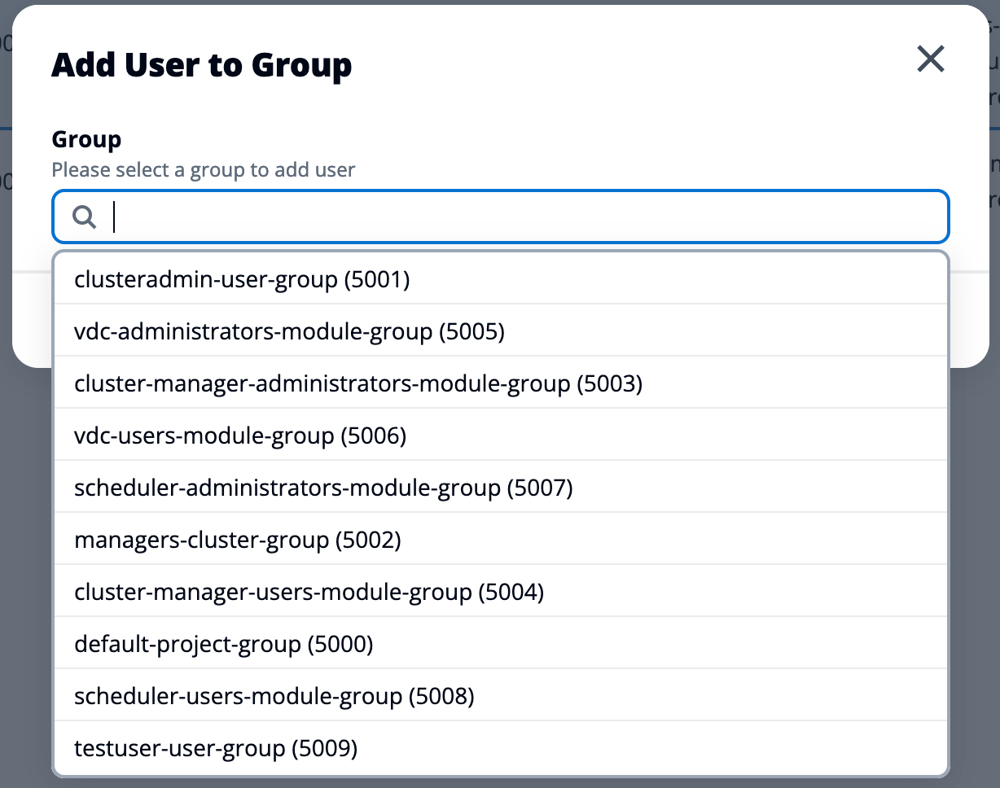

# Users Management

New clusters use the container control plane only. Move an existing host-based control plane with `upgrade-cluster --drain`; follow the [container upgrade guide](../../first-time-users/cluster-operations/update-idea-cluster/move-to-containers.md).

To manage IDEA users, navigate to "**Administration**" > "**People and access**" > "**Users**"

<figure><figcaption><p>Users portal</p></figcaption></figure>

### Create a new user

1. Click "**Create User**"
2. Specify the username
3. Specify the email address
4. Select whether or not the email is verified.
   1. **NO** (default & recommended): A temporary password will be send to the email and user will need to change it at first login
   2. **YES**: You will be asked to manually set up a password for the user
5. Choose the permissions applicable for the user. To learn more about the different permissions, refer to [groups-management.md](groups-management.md "mention")
6. Choose the login shell

If "**Email is Verified**" is not checked during account creation, the user will receive a welcome email message with a temporary password. User will be required to change this password after first successful login.

<figure><figcaption><p>Example of invitation email</p></figcaption></figure>

### Understanding Confirmation Status

Confirmed: User can log in to IDEA

Force Change Password: User will be required to change his/her password after the next successful login

### Enable a user

* Select a user with Status set to "Disabled"
* Click "**Actions**" then "**Enable User**"

### Disable a user

* Select a user with Status set to "Enabled"
* Click "**Actions**" then "**Disable User**"

### Give user Cluster Admin privileges

* Select a standard user
* Click "**Actions**" then "**Set as Admin user**"

### Remove Cluster Admin privileges for a user

* Select a user with admin privileges
* Click "**Actions**" then "**Remove as Admin user**"

### Add user to group

* Select the user
* Click "**Actions**" then "**Add User to Group**"
*   Choose the group from the list

    <figure><figcaption><p>Example of group selection</p></figcaption></figure>

### Remove user from group

* Select the user
* Click "**Actions**" then "**Remove User From Group**"
* Select the group(s) you want your user to be removed from

### Reset password for a user

* Select the user
* Click "**Actions**" then "**Reset Password**"


You cannot reset the password of a user if his/her confirmation status is not "Confirmed"


### Review background task failures

The **Status** column shows an error indicator when a terminal background task fails for a user. Read the task name, failure message, and time, correct the cause, then repeat the action. The indicator clears when the same task succeeds.

### Grant personal desktop instance types

Select a user, then choose **Actions > Set virtual desktop instance types**. Select the extra instance types this user may launch without changing the global or software-stack allow list. The global deny list still takes precedence. Save an empty selection to remove all personal exceptions.

### Add a batch of users

Login to the cluster manager and run `ideactl accounts batch-create-users` to create multiple users in a single command. Users information (username/email ...) must be specified via a .csv file

### ideactl accounts

IDEA provides `ideactl` utility in case you cannot access the web interface but needs to interact with users. To get started, log in to the **Cluster Manager** EC2 machine and run `ideactl accounts`

```
ideactl accounts
Usage: ideactl accounts [OPTIONS] COMMAND [ARGS]...

  account management options

Options:
  --help  Show this message and exit.

Commands:
  batch-create-users  creates users from csv file
  create-user         create new user account
  delete-user         delete user
  disable-user        disable user
  enable-user         enable user
  get-user            get user
  list-users          list existing users
  modify-user         update an existing user account
```

For example, here is how to create a new user, setting a temp password and giving this user admin permission

```bash
# ideactl accounts create-user --email "sampleuser@example.com" --password "Password123@" --username "sampleuser2" --sudo --email-verified
{
  "username": "sampleuser2",
  "email": "sampleuser@example.com",
  "uid": 5068,
  "gid": 5077,
  "group_name": "sampleuser2-user-group",
  "login_shell": "/bin/bash",
  "home_dir": "/data/home/sampleuser2",
  "sudo": true,
  "status": "CONFIRMED",
  "enabled": true,
  "created_on": "2022-12-21T16:37:32.033000+00:00",
  "updated_on": "2022-12-21T16:37:32.033000+00:00"
}
```
