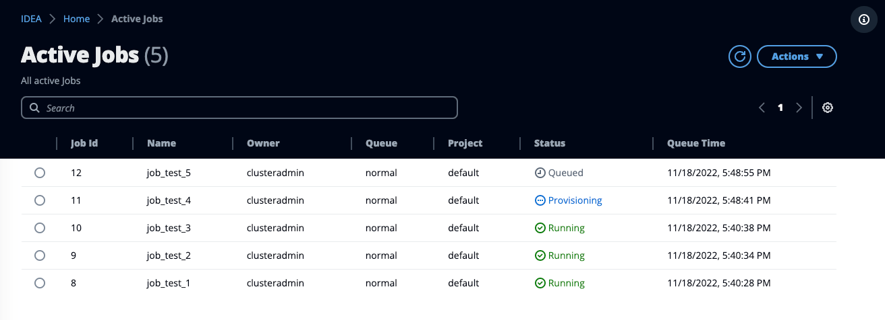
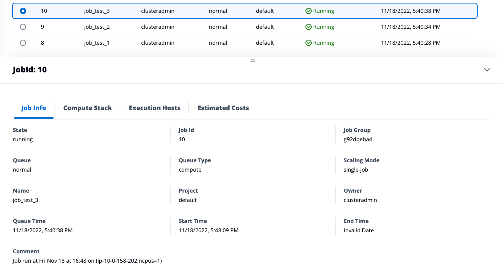
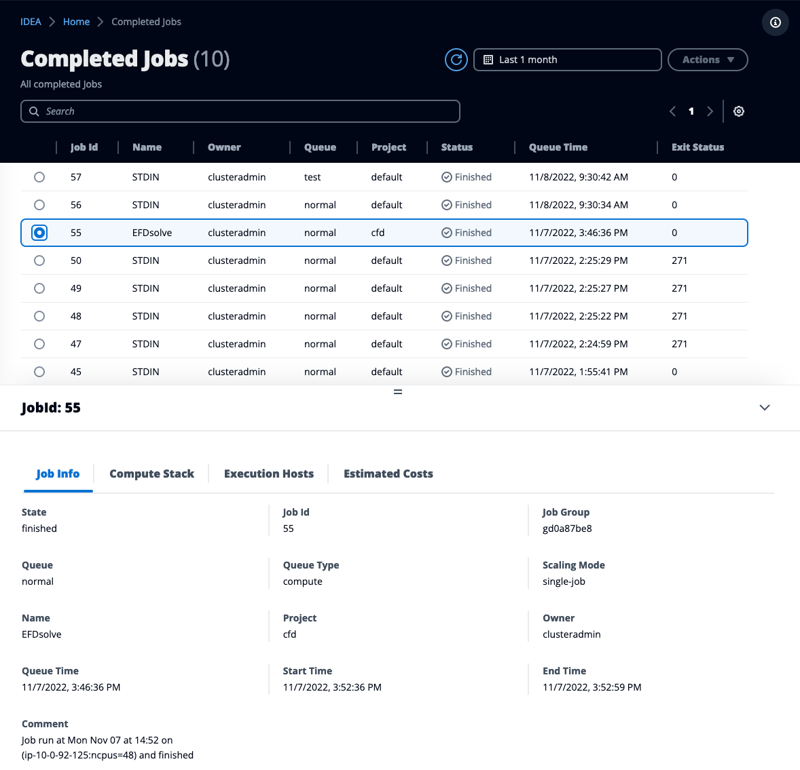

# Control my jobs

Once your job is submitted ( [submit-a-job.md](submit-a-job.md "mention")), you can access the job information via "**My jobs**", in either the "**Active**" or "**Completed**" view (depending whether your job is running or not).

The status cell and job details show the scheduler's `status_reason`, including capacity waits, provisioning errors, and the attempt count and last error when a job is held.

## Active Jobs

Active jobs will list all the jobs currently active in the job queue. Select one job ID to get further details about it such as the execution hosts, scheduler metadata ...


As a regular user, you can only see your jobs. As an admin, you can view everyone's else jobs (click "**Active Jobs**" under the Admin section)


<figure><figcaption>
Real-Time view of the jobs available in the scheduler queue
</figcaption></figure>

You can terminate your running job(s) or get information about finished job(s) via the "**My jobs**" page.

To delete a job, select the job then click "**Actions**" > "**Delete Job**"

To get detailed information about a job, select the job id and refer to the Details section

<figure><figcaption>
Detailed Job view gives you details about the job, compute provisioned, execution hosts and estimated costs
</figcaption></figure>

## Completed Jobs

Access "My jobs" > "Completed" to get a historical of all the jobs.


As a regular user, you can only see your jobs. As an admin, you can view everyone's else jobs (click "**Completed Jobs**" under the Admin section)


<figure><figcaption>
List of all completed jobs
</figcaption></figure>

Similarly to [#active-jobs](control-my-jobs.md#active-jobs "mention"), you can expand the details section to review your job information (start/end time, execution host(s) etc ...)

Completed jobs retain a **Ran**, **Failed**, **Held**, or **Deleted** disposition, including jobs cancelled before starting and jobs deleted because their owner is disabled. The recorded reason explains the outcome. **Estimated Costs** shows elapsed-runtime estimates and savings; missing pricing reads **Price not available**. **Budget impact** shows recorded budget usage when available. See [Job status and costs](../../../first-time-users/jobs.md).
