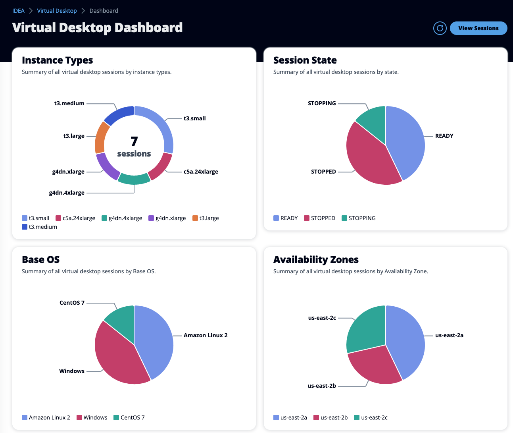

# Dashboard

Dashboard page gives VDI administrators insights into their VDI infrastructure. By default, admins can visualize the number of sessions deployed, their current state, the software stack being used and more.

<figure><figcaption>
Example of VDI charts
</figcaption></figure>
