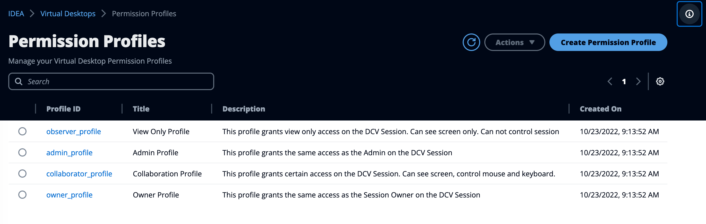
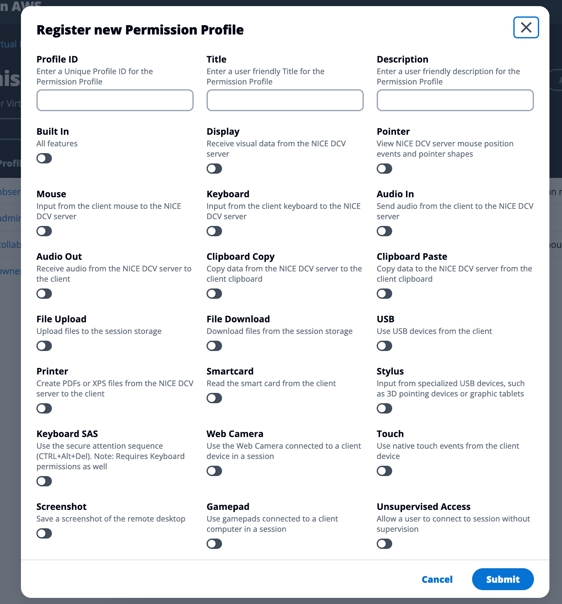

# Permissions management

IDEA Virtual Desktop Interface enable sessions sharing. Sharing a session is particularly useful if you are planning to do live debugging with your collaborators. Read [https://github.com/cfs-energy-internal/idea/blob/docs-update/docs/modules/virtual-desktop-interfaces/user-documentation/share-a-virtual-desktop.md](https://github.com/cfs-energy-internal/idea/blob/docs-update/docs/modules/virtual-desktop-interfaces/user-documentation/share-a-virtual-desktop.md "mention") to learn more about the use cases.

As VDI administrator, you do have the ability to manage the current permission profiles available to your users. By default, IDEA ships with multiple pre-configured Permission Profiles:

* **observer**: Read/Only access to the session
* **admin**: Full privileges on the session
* **collaborator**: Can see screen + control mouse and keyboard
* **owner**: Grant same permissions as the virtual desktop session owner

<figure><figcaption>
Visualize all permission profiles available to the users
</figcaption></figure>

### Create a custom permission profile

Click "**Create Permission Profile**" button and fill out the form:

* Profile ID: Unique profile ID (e.g: observer\_profile)
* Title: Friendly name (e.g: View Only Profile)
* Description: Description of the profile

Then select what permission(s) you want to apply by using the toggle buttons

<figure><figcaption>
Create a new permission profile
</figcaption></figure>

Once done, click "**Submit**" button. The profile will then be available to use by the users (refer to [permissions-management.md](permissions-management.md "mention") for more details)
