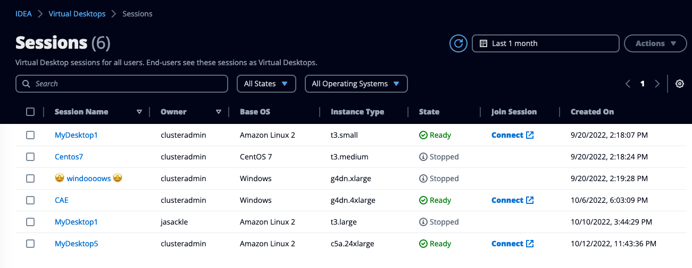

# Sessions

VDI Administrators have the ability to list and control all virtual desktop sessions deployed on the IDEA environment.

<figure><figcaption>
Admin dashboard for VDI sessions
</figcaption></figure>

### Join a session

To join an active session, click "**Connect**" button.

### Stop/Terminate a session

Click "**Actions**" button to get a list of all available options


**Difference between force and regular stop/termination:**

Force option will be executed even if there is an active connection on the desktop. Use regular option If you want to be on the safe side and avoid disconnecting users.


<figure><figcaption>
View all virtual desktop sessions for your entire organization
</figcaption></figure>

Administrators can view and manage all desktop sessions across users and projects from this view. To manage sessions, select one or multiple sessions and click "**Actions**" to see all available operations:

* **Launch DCV Session**: Open the selected session in DCV viewer
* **Download DCV Session File**: Download the DCV file (to be opened with the DCV client)
* **Stop Session**: Stop the virtual desktop (but keep the data)
* **Terminate Session**: Delete the session and all associated data
* **Create Stack from Session**: Create a new Software Stack (AMI) based on the selected session
* **Show Info**: Display detailed information about the session
* **Edit Session**: Modify session parameters
* **Enable Session Boot Script**: Set up a boot script to run when the instance starts
* **Edit Permissions**: Configure session sharing

## Launching Sessions on Behalf of Users

As an administrator, you can launch virtual desktop sessions on behalf of users. This is particularly useful when users need specialized instance types that aren't defined in the standard allowed lists.

To launch a session for a user:

1. Navigate to the appropriate project where the user has permissions
2. Click "**Launch new Virtual Desktop**"
3. Enter the session details and select the owner from the dropdown menu
4. Select the desired instance type, even if it's not in the standard allowed list
5. Click "**Submit**" to create the session for the user

This administrative override allows flexibility for special use cases while maintaining the standard restrictions for regular users.


Sessions created by administrators on behalf of users will be owned by the selected user and will count against that user's session limit.

