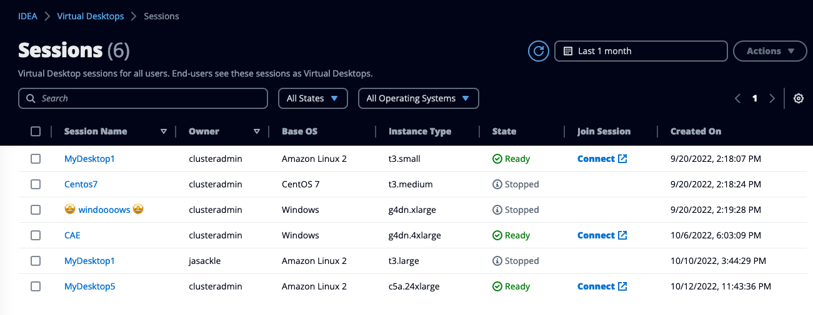

# Sessions

VDI Administrators have the ability to list and control all virtual desktop sessions deployed on the IDEA environment.

<figure><figcaption>
Admin dashboard for VDI sessions
</figcaption></figure>

### Join a session

To join an active session, click "**Connect**" button.

### Stop/Terminate a session

Click "**Actions**" button to get a list of all available options


**Difference between force and regular stop/termination:**

Force option will be executed even if there is an active connection on the desktop. Use regular option If you want to be on the safe side and avoid disconnecting users.


Administrators can view and manage all desktop sessions across users and projects from this view. To manage sessions, select one or multiple sessions and click "**Actions**" to see all available operations:

* **Launch DCV Session**: Open the selected session in DCV viewer
* **Download DCV Session File**: Download the DCV file (to be opened with the DCV client)
* **Stop Session**: Stop the virtual desktop (but keep the data)
* **Terminate Session**: Delete the session and all associated data
* **Create Stack from Session**: Create a new Software Stack (AMI) based on the selected session
* **Show Info**: Display detailed information about the session
* **Edit Session**: Modify session parameters
* **Enable Session Boot Script**: Set up a boot script to run when the instance starts
* **Edit Permissions**: Configure session sharing

## Launching Sessions on Behalf of Users

As an administrator, you can launch virtual desktop sessions on behalf of users. This is particularly useful when users need specialized instance types that aren't defined in the standard allowed lists.

To launch a session for a user:

1. Navigate to the appropriate project where the user has permissions
2. Click "**Launch new Virtual Desktop**"
3. Enter the session details and select the owner from the dropdown menu
4. Select the desired instance type, even if it's not in the standard allowed list
5. Click "**Submit**" to create the session for the user

This administrative override allows flexibility for special use cases while maintaining the standard restrictions for regular users.


Sessions created by administrators on behalf of users will be owned by the selected user and will count against that user's session limit.


## Desktop Placement

By default a desktop is launched into the first available subnet from the desktop subnet list, or from the cluster private subnets when no desktop list is configured. Setting `cluster.network.preferred_subnet_id` to one of those subnets moves it to the front of that order, so every session launched without an explicit subnet tries it first. Point it at the subnet holding a shared filesystem that lives in a single availability zone, such as an FSx for NetApp ONTAP single-AZ file system, to keep desktop I/O out of a cross zone path.

If the preferred zone has no capacity for the requested instance type, the launch falls through to the next subnet within the same request, so the preference never costs a user a desktop. That fallback depends on `virtual-desktop-controller.dcv_session.network.subnet_autoretry`, which is true by default. If you turn it off, the preferred subnet becomes a hard pin and every desktop fails while its availability zone is out of capacity; the controller logs a warning at startup when it finds that combination.

The same setting places scheduler jobs, so one value covers both. Leaving it empty keeps the existing behavior, and a session launched with an explicit subnet ID under Advanced Options is never affected.

## Desktop Event Queue

Every session action reaches the controller as a message on the `<cluster>-<module>-events.fifo` SQS queue. A message whose handler fails is left on the queue so it is retried, but a message that fails every time would be redelivered forever and hold up the events behind it.

`virtual-desktop-controller.events.max_receive_count`, default `3`, bounds that. Below the bound the message is redelivered as before, so a transient failure still recovers on its own. On the bounding receive the controller logs the message ID, the event type and the session ID at error level, then deletes the message. Raise the setting to give slow-to-recover failures more attempts; it takes effect on the next controller restart and needs no redeploy.

The queue also has a dead letter queue, `<cluster>-<module>-events-dlq.fifo`, with a redrive policy of 16 receives, which catches messages the controller never processes at all, such as a restart between handling and deleting. The controller-side bound fires first, so anything reaching the dead letter queue was not dropped by the controller. Search the virtual desktop controller log for `Deleting the message instead of blocking the queue` to find the events that were dropped.
