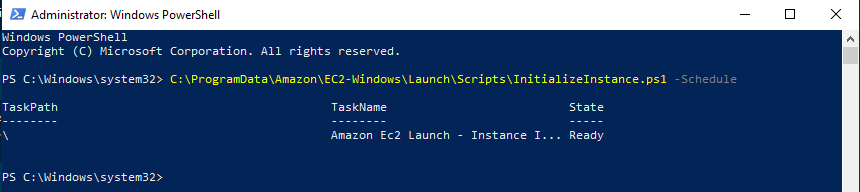
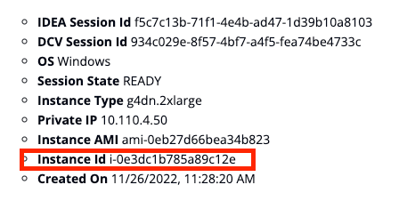

# Virtual Desktop Images (Software Stacks)

A Software Stack is an Amazon Machine Image (AMI - pronounced [Ay-Em-i](https://twitter.com/Werner/status/1182530158026055681)) with your applications pre-installed and configured for your users. Users can then provision their virtual desktops easily with all the software pre-loaded and ready to be used.

<figure><figcaption><p>List all AMI available to the users</p></figcaption></figure>

### Prepare a virtual desktop to be used as Software Stack

#### Windows


**IMPORTANT**

A Software Stack, also known as Amazon Machine Image (AMI), is a complete snapshot of your EC2 host.

**Make sure you do not have any confidential data hosted on your Virtual Desktop before creating the image.**

Here is a non exhaustive list of recommendations you must review prior to creating the image:

* [x] It's highly recommended to start creating a new Software Stack from a brand new Virtual Desktop.
* [x] Verify you have not stored any passwords on your internet browser. It's recommended to clear the cache of all browsers.
* [x] Verify there is no confidential information on your current $HOME directory.
* [x] Verify your Document/Download/Desktops folders are empty or don't contains any confidential information.
* [x] Verify the list of local user(s) that belong to the "Administrators" group. User(s) who have Administrator permissions on the virtual desktop will inherently have the same permissions on all future desktops launched by the software stack.
* [x] As an extra step, you can completely delete your $HOME directory


First, launch your Virtual Desktop and install some applications. Once you are done, click the Search Button and right-click on "Windows PowerShell" to "Run As Administrator".

<figure><figcaption><p>Click Windows button and launch "Windows Powershell"</p></figcaption></figure>

On the PowerShell terminal, execute the following command to re-enable the execution of EC2 UserData script.

```powershell
C:\ProgramData\Amazon\EC2-Windows\Launch\Scripts\InitializeInstance.ps1 -Schedule
```

<figure><figcaption><p>Re-enable EC2 UserData Script</p></figcaption></figure>

At this point, go back to the IDEA Virtual Desktops web-interface, select your Virtual Desktop and click "**Action**" > "**Show Info**" to display detailed details about your desktop, then search for "**Instance ID**".

<figure><figcaption><p>Locate the instance ID of the desktop you are about to snapshot</p></figcaption></figure>

Open your EC2 console and search for your instance then click "**Actions**" > "**Image and templates**" > "**Create Image**"

<figure><figcaption><p>Create an image of your EC2 Desktop</p></figcaption></figure>

Choose a name and a description, make sure to check "**No Reboot: Enable**" then click "**Create Image**"

<figure><figcaption><p>Make sure "No Reboot" is enabled.</p></figcaption></figure>

Navigate to the AMI tab and verify if your image status is "available" and copy your AMI ID.

<figure><figcaption><p>Wait until the image is fully available</p></figcaption></figure>


**My AMI is taking forever:**

You will not be able to use your image until the status is available.

Creating an AMI may take a couple of hours depending the size of the image.

To check the progress of your image, navigate to "Snapshots" section and refer to the `Progress` column for all EBS volumes created by your image




Once your AMI is in available state, log in to IDEA and refer to [#register-a-new-software-stack-on-idea](virtual-desktop-images-software-stacks.md#register-a-new-software-stack-on-idea "mention")

### Register a new Software Stack on IDEA

To register a new Software Stack, click "**Create Software Stack**" under the "**Software Stacks (AMIs)**" section

You will be asked to enter a name, description and other parameters specific to your image.

You will also need to specify which IDEA Projects are authorized to use this image. Refer to[projects-management.md](../../cluster-manager/projects-management.md "mention") for more information on IDEA Projects.


Storage Size (GB) must match the size of the EBS volumes attached at the time of the image creation


<figure><figcaption><p>Fill out the form to create the image</p></figcaption></figure>

### Managing Software Stacks

Once a Software Stack is created, administrators can manage the stacks from the Software Stacks table. The table now supports multi-select functionality, allowing administrators to perform actions on multiple stacks simultaneously.

#### Enable/Disable Software Stacks

Administrators can enable or disable Software Stacks to control their availability to users without deleting them. This is useful when you want to temporarily restrict access to certain stacks.

1. Select one or multiple Software Stacks from the table
2. Click "**Actions**" and select "**Enable**" or "**Disable**"

Disabled Software Stacks will not appear in the user's selection when creating a new Virtual Desktop.

#### Delete Software Stacks

To completely remove a Software Stack from the system:

1. Select one or multiple Software Stacks from the table
2. Click "**Actions**" and select "**Delete**"


Deleting a Software Stack is permanent and cannot be undone. Consider disabling a Software Stack instead if you might need it again in the future.


#### Setting Allowed Instance Types

Administrators can now define which instance types are allowed for each Software Stack. This provides fine-grained control over what compute resources users can select based on the software requirements of each stack.

To set allowed instance types for a Software Stack:

1. Select a Software Stack and click "**Actions**" > "**Edit Software Stack**"
2. In the "**Allowed Instance Types**" section, specify the instance types that users can select when launching a session with this Software Stack
3. Click "**Submit**" to save your changes

This setting will override the global instance type restrictions and only show the specified instance types to users when they select this Software Stack during session creation.

### Use your new Virtual Desktop Software Stack

Once created, the Software Stack will be visible to all users who belong to the associated project(s). Refer to [create-a-virtual-desktop-linux-windows.md](../user-documentation/create-a-virtual-desktop-linux-windows.md "mention") to learn how to launch your desktop with the new image
