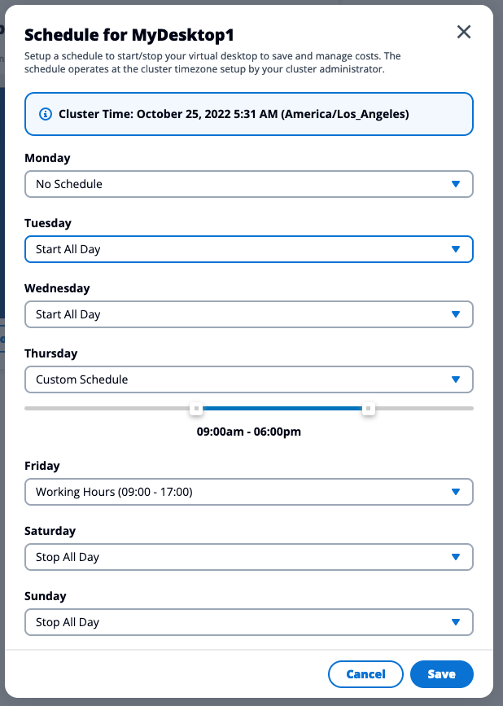

# Virtual desktop scheduling

By default, your virtual desktop comes with the Stop On Idle schedule. This will stop/hibernate your virtual desktop only when the CPU use is below the cluster set utilization threshold. Default is 30%. AND when no one has logged in for at least the cluster AutoStop idle timeout. Default is 1 hour.


Virtual Desktop will only be stopped if idle (e.g: no active session connected within the Idle Timeout period and CPU usage below 30%). This is meant to prevent accidental stop and ensure you won't have to worry if you have a simulation running on your desktop overnight but have configured auto-stop after 8PM


You can change this behavior by configuring your own scheduling, and IDEA will ensure your desktop will automatically start/stop based on your own requirements.

There are a number of schedules to choose from. Please review the table below.

<table><thead><tr><th width="186">Mode</th><th width="222">Running Desktop</th><th>Stopped Desktop</th></tr></thead><tbody><tr><td>No Schedule</td><td>Stay running until you stop/terminate</td><td>Stay stopped until you manually restart it</td></tr><tr><td>Stop On Idle</td><td>Will be stopped if idle after AutoStop Idle timeout &#x26; CPU use is less than Utilization Threshold</td><td>Will stay stopped</td></tr><tr><td>Started All Day</td><td>Will stay running</td><td>Will be automatically started after 00H</td></tr><tr><td>Working Hours</td><td>Will be started at 9 AM</td><td>Will be stopped if idle after 5 PM</td></tr><tr><td>Custom Schedule</td><td>Will be started based on your own time</td><td>Will be stopped if idle based on your own time</td></tr></tbody></table>

Simply click the dropdown menu to chose your schedule for that day using the different presets below:

You can at any moment review whether or not you have a schedule configured for the current day on your virtual desktop by checking the settings bar of your session (note: schedule are unique to each desktop)

<figure><figcaption>
Verify if a schedule is applicable by checking the settings bar
</figcaption></figure>

To create/edit a schedule, click "**Actions**" > "**Schedule**". This will open a new modal where you will be able to choose the schedule for any given day:

<figure><figcaption>
Set a custom schedule per day
</figcaption></figure>


Schedule is re-evaluated every 30 minutes

